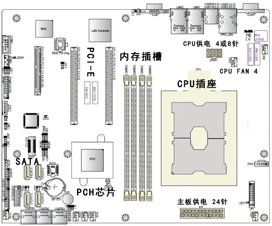

## 模块1 认识计算机

### 任务一 认识计算机系统的组成

#### 1.1 计算机硬件系统

五个基本组成部分（**程序存储原理**）

#### 1.2 计算机软件系统

计算机系统体系结构图

附：

*①操作系统软件：DOS、Linux、Windows。*

*②服务性程序：机器调试、故障检查、诊断程序、**杀毒软件**。*

*③数据库管理系统：SQL Server、Oracle、Informix。*

#### 1.3 计算机发展史

第一台计算机：ENIAC（埃尼阿克）

IBM卖个人电脑业务（ThinkPad也是）给联想（Lenovo）。

首款图形用户界面（GUI）个人计算机为苹果（Apple）公司的Mac计算机，使用MacOS操作系统。

世界上第一台笔记本电脑为日本东芝的T1000。

常见典型的PC机有：台式计算机、笔记本电脑、一体机等。

平板电脑的主流操作系统：Windows、Android、IOS、HarmonyOS等。

PC的发展趋势：**体积微型化**、**资源网络化**、**处理智能化**。

### 任务2 认识计算机的基本配置

#### 1.4 计算机基本配置

##### 1.主板

主板MainBoard，又称母板MotherBoard

###### （1）主要参数

主板芯片、处理器规格、内存规格、存储扩展、I/O接口、板型、软件管理、其他参数。

###### （2）主要功能（开机时主板工作过程）

主板在加电并收到电源的 Power_Good 信号后，由时钟电路产生系统复位信号，CPU 在复位信号的作用下开始执行 BIOS 中的 POST 程序。POST 一旦顺利通过，就开始操作系统的引导及接受用户的任务直至关机。在计算机的整个运行期间，主板的工作就是在芯片组、时钟、BIOS的统一配合下，完成 CPU 与内存、内存与外设，外设与外设间的数据传送。也可以说，主板的作用就是同步、传递数据。

###### （3）基本组成

**芯片**：芯片组、BIOS芯片、集成声/网卡芯片 等。

**内部接口**：CPU插座、内存插槽、PCI-E 16X、PCI-E 1X、SATA接口、前置面板插针、主板供电接口（24针）、CPU供电接口（8针）、风扇接口（FAN）。

**前置面板插针**：PWR_SW、RESET、PWR_LED、HDD_LED、SPEAKER。

**外部接口**：PS/2、USB、VGA、DVI、HDMI、RJ-46、Audio等。

###### （4）常见规格

①ATX				12in × 9.6in

②Mini-ATX	15cm × 15cm

③Micro-ATX	9.6in × 9.6in

④ITX					17cm × 17cm

###### （5）总线Bus

①数据总线：CPU与RAM之间。

②地址总线：RAM中存储的数据的地址。

③控制总线：一般常见的为USB Bus和1394 Bus。

④扩展总线：扩展槽和计算机。

⑤局部总线

###### （6）芯片组架构

①南北桥架构

②MCH+ICH（IHA）

③PCH架构 

④单芯片架构（SoC，System on Chip）

##### 2.CPU

中央处理器（CPU），内部结构大致可分为**控制单元**（CU）、**算术逻辑单元**（ALU）、**存储单元**（Cache，高速缓存）。

###### （1）主要参数

基本参数：适用类型（台式机、笔记本…）、系列、制作工艺、核心代号、插槽类型、包装形式。

性能参数：主频、睿频、核心数、线程数、三级缓存、总线规格、热设计功耗。

内存参数：支持最大内存、内存类型、内存通道数、ECC内存支持。

显卡参数：集成显卡、基本频率、最大动态频率、最大分辨率、显示支持数、其他显示技术。

技术参数：睿频、超线程、虚拟化、指令集。

###### （2）工作原理

CPU是执行程序的部件，程序是由一条条指令组成的，可以提前存储在计算机内存中。基于“程序存储”原理的CPU运作可分为4个阶段：提取、解码、执行和写回。

###### （3）CPU基本参数

①主频。也叫时钟频率，单位MHz，用来表示CPU运算速度，但不代表CPU的全部性能。外频和倍频的乘积就是主频。

②外频。CPU的基准频率。

③前端总线（FSB）频率。CPU和北桥芯片之间数据总线的时钟频率。

④缓存。解决CPU与主存之间的速度差。

⑤总线宽度。地址总线宽度决定了CPU可访问的物理地址空间大小。

⑥封装形式。

**缓存的工作原理**：缓存的工作原理是当C PU 读取一个数据时，首先从缓存中查找，如果找到就立即读取并送给CPU处理；如果没有找到，从相对慢速的内存中读取并送给CP U 处理，同时把这个数据所在的数据块调入缓存中，可以使得以后对整块数据的读取都从缓存中进行，不必再访问内存，以提高数据的访问速度。

###### （4）CPU内核

###### （5）Intel酷睿i系列命名规则

###### （6）超线程

超线程技术（Hyper-Threading，HT），是利用特殊的硬件指令，把单个物理核心模拟成两个逻辑核心，让每个核心都能使用线程级并行计算，进而兼容多线程操作系统和软件，减少了 CPU 的闲置时间，提高CPU 的运行效率。

##### 3.硬盘

###### （1）结构

①外部结构

| 类型      | 电源接口 | 数据接口                 |
| --------- | -------- | ------------------------ |
| IDE(PATA) | 4口D型   | 40针（数据线40线或80线） |
| SATA      | 15针     | 7针                      |

②物理结构

③逻辑结构

每扇区，512B。

各分区可采用不同的分区类型，常见的有FAT(16、32)、NTFS等。

快速格式化仅清空FAT区和根目录区，不操作数据区，（删除和清空回收站亦然），因此可以通过数据找回软件找回。

###### （2）引导原理

①主引导扇区：0面0道1扇区，主引导记录MBR + 分区表DPT + 结束标志

主引导扇区位于整个硬盘的0磁头0柱面1扇区，包括硬盘主引导记录MBR和分区表DPT

主引导记录（MBR）的作用：检查分区表是否正确以及确定哪个分区为引导分区，并在程序结束时把该分区的启动程序（也就是操作系统引导扇区）调入内存加以执行。

分区表（DPT）作用：记录着硬盘的分区信息。

512字节的主引导扇区，MBR占了446字节，DPT占了64字节，2个字节的有效结束标志。

| 描述             | 尺寸（字节） |
| ---------------- | ------------ |
| 引导程序代码区域 | 446          |
| 分区表DPT        | 64           |
| 结束标志55AA     | 2            |

②分区的FAT文件系统结构

**i.操作系统引导记录OBR。**通常位于0面1道1扇区，包括一个引导程序和本分区参数记录表BPB。

引导程序：主要任务是判断本分区根目录前两个文件是否为操作系统的引导文件，如果是，就把第一个文件读入内存，并把控制权交予该文件。

BPB参数块：记录着本分区的起始扇区、结束扇区、文件存储格式、硬盘介质描述符、根目录大小、FAT 个数、分配单元的大小等重要参数。

OBR 由高级格式化程序产生。

**ii.文件分配表FAT。**为数据安全考虑，有两个。

**iii.目录区DIR。**记录着每个文件（目录）的起始单元、文件的属性。

**iv.数据区。**

为什么格式化分区后数据可以恢复：

通常所说的高级格式化程序，并没有把 DATA 区的数据清除，只是重写了FAT表和DIR表而已，至于分区硬盘，也只是修改了MBR 和 OBR，绝大部分的DATA 区的数据并没有被改变，这也是许多硬盘数据能够得以修复的原因。

###### （3）硬盘主要性能参数

**①分类**

&emsp;i.按尺寸：2.5 in、3.5 in。

&emsp;ii.按接口：IDE、SCSI、SATA

**②容量**

&emsp;硬盘容量 = 磁头数 × 柱面数 × 扇区数 × 512B

&emsp;硬盘容量 = 单碟容量 × 碟片数

**③转速**

&emsp;单位rpm（Revolutions per minute）

**④缓存**

**⑤平均寻道时间**

**⑥数据传输率**

（4）固态硬盘SSD

结构：控制单元、存储单元。

优点：低功耗、无噪声、抗震动、低热量。缺点：成本高，损坏不可挽救。

##### 4.内存

###### （1）作用与分类

| 类型       | 电压             | 线数 |
| ---------- | ---------------- | ---- |
| SDRAM      | 3.3V             | 168  |
| DDR SDRAM  | 2.5V             | 184  |
| DDR2 SDRAM | 1.8V             | 240  |
| DDR3 SDRAM | 1.5V 1.35V 1.25V | 240  |
| DDR4 SDRAM | 1.2V             | 284  |

###### （2）主要性能指标

①存储容量②存取速度③工作频率④接口类型⑤CL设置

###### （3）双通道技术

##### 5.显卡

显卡又称显示适配卡，是连接主机与显示器的接口卡。其作用是将主机输出的信息转换成字符、图形和颜色等信息，传送到显示器上显示。

###### （1）结构及工作原理

**显卡工作原理：**

①将CPU送来的数据送到图形处理器（GPU）进行处理。

②将图形处理器处理完的数据送到显存。

③由显存读取出数据并送到RAMDAC进行数据转换工作（数字信号转换成模拟信号）

④将转换完的数据送到显示器显示。

###### （2）主要性能指标

①显存（速度、位宽、容量）

②显示核心GPU

③散热方式（被动散热、主动散热）

④显卡接口

⑤物理特性（渲染流水线、API、顶点着色单元、像素着色单元）

##### 6.声卡

声卡：集成声卡、独立声卡。软声卡、硬声卡。

独立显卡优点：较先进，更好的显示效果和性能，容易硬件升级。缺点：功耗和发热量大、占用扩展插槽、需额外购买。

接口：绿耳红麦蓝输入。

##### 7.网卡NIC

传输介质：双绞线、同轴电缆、光纤。

双绞线采用RJ-45接口。

MAC地址写入ROM芯片中。

##### 8.显示器

CRT：阴极射线管显示器。

LCD：液晶显示器。

LED：采用LED发光二极管的液晶显示器。

###### 液晶显示器工作原理

液晶显示器工作时，背光源（灯管）射出光线经过一个偏光板，然后再经过液晶，到达前方的彩色滤光片与另一块偏光板。根据其间电压的变化控制液晶分子的排列方式实现不同的光线强度与色彩，从而在液晶显示屏上形成丰富多彩的图像效果。

###### 液晶显示器主要性能参数

①点距和可视面积						⑤响应时间

②最佳分辨率和刷新率				⑥可视角度

③亮度											⑦最大显示色彩数

④对比度										⑧点缺陷（亮点、暗点、坏点）

##### 9.其他设备

###### （1）机箱

立式、卧式。ATX、Micro-ATX、NLX。

###### （2）无线技术

①蓝牙：2.4~2.485GHz的UHF无线电波。

②无线键盘/鼠标：红外、蓝牙。

无线通信方式：蓝牙、WiFi（IEEE802.11）、Infared（IrDA）、ZigBee（IEEE 802.15.4)。

###### （3）音箱：倒相式、密闭式。

###### （4）光驱

光盘种类：CD-ROM、CD-R、CD-RW。

①结构：手动退盘孔…

②工作原理

光驱在读取信息时，激光头会向光盘发出激光束，当激光束照射到光盘的凹面或非凹面时，反射光束的强弱会发生变化，光驱就根据反射光束的强弱，把光盘上的信息还原成数字信息，即“0”或“1”，再通过相应的控制系统，把数据传给计算机。

###### （5）打印机

按打印原理分为：针式打印机、喷墨打印机、激光打印机。

喷墨打印机：墨水、喷头。

激光打印机：碳粉、磁鼓。

###### （6）扫描仪

从原理分：CCD、CIS。

###### （7）U盘

采用Flash Memory存储技术的USB设备。

###### （8）摄像头

摄像头一般具有视频摄影和静态图像捕捉等功能，是借由镜头采集图像后，由摄像头内的感光组件电路及控制组件对图像进行处理，并转换成计算机所能识别的数字信号，然后借由并行端口或USB端口连接输入计算机后由软件再进行图像还原。

###### （9）麦克风Microphone

#### 1.5计算机主要端口

##### 1.常见多媒体端口

（1）高清多媒体接口HDMI：可发送未压缩音频及视频信号。

（2）数字视频接口DVI。DVI-A、DVI-D、DVI-I。

（3）视频图形阵列接口VGA，3排15针。

（4）雷电接口Thunderbolt

双向10Gbps，可传输视频、音频、数据。可兼容Mini DP。

（5）高清数字显示端口DP（DisplayPort），传输音频和视频。

（6）MiniDP

（7）AV端口。莲花头，黄白红三色。黄接视频、白红分布负责左右声道。

（8)S端子S-Video。4或7针，2亮度，2色度，1接地。

（9）S/PDIF端口

（10）分量端口

##### 2.通用串行总线USB

USB特点：传输速度快、使用方便、支持热插拔、连接灵活、独立供电、兼容性好。

**USB如何实现热插拔**：USB接口内部的4根金手指，外侧2根供电线长，内侧2根数据传输线短。当插入设备时，外侧电源线首先连接供电，保证中间的数据线在通电状态下进行数据交换；当拔出设备时，先断开数据传输，保证数据不会因断电而丢失，然后再将设备电压切断。

| 类型    | 速率     | 插针 | 电压       | 其他         |
| ------- | -------- | ---- | ---------- | ------------ |
| USB 1.0 | 1.5 Mb/s | 4    | 5V         | 白色         |
| USB 1.1 | 12 Mb/s  | 4    | 5V         | 白色         |
| USB 2.0 | 480 Mb/s |      | 5V         | 白/黑色      |
| USB 3.0 | 5.0 Gb/s | 9    | 5V         | 蓝色         |
| USB 3.1 | 10 Gb/s  | 9    | 5V/12V/20V | 最大功率100W |

USB OTG：USB On-To-Go。

Always on USB：断电后USB仍可供电。

参考资料：

