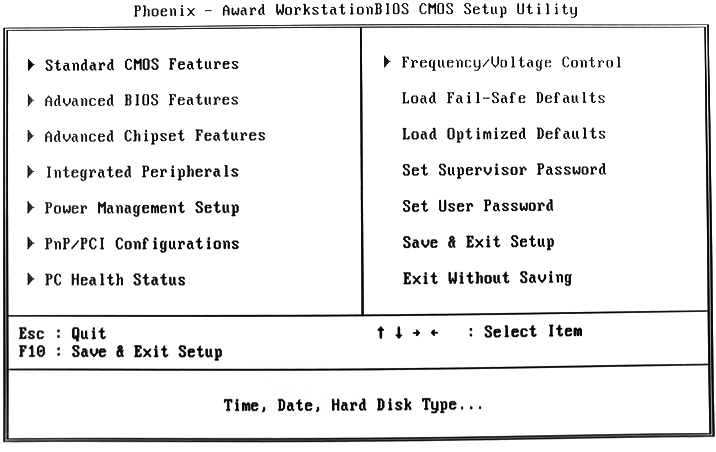
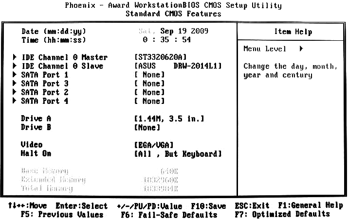
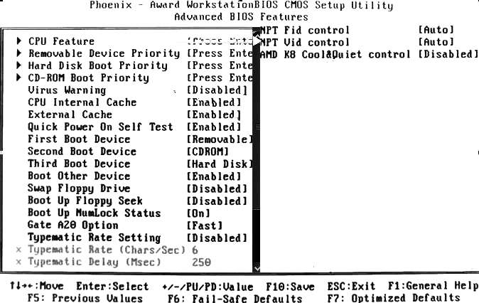
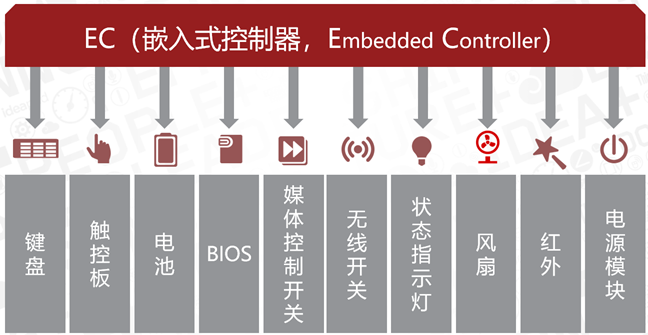

# 模块3 BIOS基本设置

## 任务5 进行BIOS设置

### 3.1 BIOS 与 CMOS 的区别

##### 1.认识 BIOS

BIOS，基本输入/输出系统

##### 2.认识 CMOS

CMOS，互补金属氧化物半导体，通常指主板上的一块可读写的RAM芯片，存储了计算机系统的实时时钟信息和硬件配置信息等。现在一般集成在南桥芯片中。

##### 3.BIOS 与 CMOS 的区别

①BIOS是一组固化在主板上只读存储器芯片中的管理计算机基本硬件的程序；CMOS是主板上的一块可读写的RAM芯片，是系统参数存放的地方，主板上的后备电池为其供电。

②计算机系统启动时，BIOS程序读取CMOS中的信息，初始化计算机各部件的状态。

③通过BIOS设置程序对CMOS参数进行设置。

### 3.2 BIOS 基本功能

##### 1.自检及初始化

①POST加电自检②初始化③引导程序。

##### 2.程序服务处理和硬件中断处理

常见中断号：10H视频服务，05H屏幕打印，14H磁盘及串口服务。

### 3.3 BIOS 自检响铃的含义

Award BIOS自检响铃的含义

| 响铃     | 含义                               |
| -------- | ---------------------------------- |
| 1短      | 正常启动                           |
| 1长1短   | RAM或主板出错                      |
| 1长2短   | 显示器或显示卡错误                 |
| 1长3短   | 键盘控制器错误                     |
| 1长9短   | 主板Flash RAM或EPROM错误，BIOS损坏 |
| 不断长响 | 内存条未插好或损坏                 |
| 重复短响 | 电源存在问题                       |

### 3.4 设置 BIOS 参数

##### 1.如何进入 BIOS 设置

Award按Del进入BIOS设置。

##### 2.Phoenix-Award 的 BIOS 设置

Phoenix-Award BIOS主菜单的含义说明

| 序号 | 菜单                      | 含义                 |
| :--: | ------------------------- | -------------------- |
|  1   | Standard CMOS Features    | 标准CMOS功能设定     |
|  2   | Advanced BIOS Features    | 高级BIOS功能设定     |
|  3   | Advanced Chipset Features | 高级芯片组功能设定   |
|  4   | Integrated Peripherals    | 外围设备设定         |
|  5   | Power Management Setup    | 电源管理设定         |
|  6   | PNP/PCI Configurations    | 即插即用/PCI参数设定 |
|  7   | PC Health Status          | PC健康状态           |
|  8   | Frequency/Voltage Control | 频率/电压控制        |
|  9   | Load Fail-Sefe Defaults   | 载入最安全的缺省值   |
|  10  | Load Optimized Defaults   | 载入最优性能缺省值   |
|  11  | Set Supervisor Password   | 设置超级用户密码     |
|  12  | Set User Password         | 设置普通用户密码     |
|  13  | Save & Exit Setup         | 保存后退出           |
|  14  | Exit Without Saving       | 不保存退出           |

###### Standard CMOS Features  

有日期、时间、外存、视频格式、挂起方式等的设置。

注意点：

①没有星期设置

②挂起方式（Halt On）：All Errors（任何错误都停）、No Errors（都不停）、All But Keyboard（键盘不停，其他停）、All But Diskette（磁盘不停，其他停）、All But Disk/Key（磁盘和键盘错误不停，其他停）。

###### Advanced BIOS Features

Hard Disk Boot Priority：多硬盘启动优先顺序。

Virus Warning：病毒报警。改MBR、DPT、OBR时暂停报警。

Quick Power On Self Test：快速检测（POST）设置。

First Boot Device：第一启动设备。

Boot Up NumLock Status：初始数字小键盘状态。

Security Option：安全菜单。System，开机就要密码；Setup，进入CMOS设置才要密码。

###### Integrated Peripherals

Onboard Lan Chip：板载网卡芯片开关。

OnChip USB：板载USB芯片模式设置。

USB Keyboard Support：DOS或BIOS下，USB键盘支持。

HD Audio：板载声卡开关。

PWRON After PWR-Fail：断电后重新来电后，系统自动开机。

#### 知识扩展

##### BIOS常见错误信息和解决方法

(1)CMOS battery failed：CMOS电池失效。

分析解决：CMOS电池电力不足，更换新电池。

(2)CMOS check sum error - Defaults loaded：CMOS求和校验错误-默认值被加载。

分析解决：电池电力不足，更换电池。如故障依旧，CMOS RAM有问题，主板返厂处理。

(3)Display switch is set incorrectly：显示开关配置错误。

分析解决：显示输出的BIOS设置与物理连接不符，更改设置或视频输出口。

(4)Press ESC to skip memory test：按ESC跳过内存测试。

分析解决：BIOS内开启Quick Power On Self Test功能。

(5)Secondary Slave hard fail：第二从盘失败。

分析解决：CMOS设置不当，硬盘数据线未接好，硬盘跳线设置不当。

(6)Override enable - Defaults loaded：超控出现，默认值被加载。

分析解决：BIOS设置不适合计算机硬件，进入BIOS重新调整。

(7)Press F1 to Continue, Del to setup：按F1继续，Del进CMOS设置。

(8)Memory test fail：内存测试失败。

分析解决：内存不兼容或有故障。分批依次插入各条内存，找出有故障的内存。

(9)hard disk install failure：硬盘安装失败。

分析解决：硬盘电源线或数据线未接好，或硬盘跳线设置不当。可以检测各连线是否插好，硬盘跳线设置是否正确。

(10)Press TAB to show POST screen：按TAB键显示POST屏幕。

##### EC 基本概念和特点

EC，电源管理芯片（或嵌入式控制器），是一个16位的单片机，笔记本独有，用来进行电源管理和键盘控制的功能芯片。

功能（了解，不用背）：

①笔记本键盘、鼠标、风扇转速的控制。

②在系统进入睡眠、休眠或关机状态下，实现系统智能电池的电量侦测、充放电控制。

③主机工作状态指示和快捷按键控制。

④控制系统的待机、休眠等状态。

##### UEFI 基本概念和特点

UEFI，统一可扩展固件接口，是操作系统与系统固件之间的软件接口，BIOS的替代方案。负责POST加电自检、联系操作系统、提供操作系统与硬件的接口。

与BIOS区别点：用模块化、C语言风格的参数堆栈传递方式，动态链接的形式构建系统。更易于实现，容错和纠错能力强，缩短研发时间。运行于32或64位模式，达到处理器最大寻址。利用加载EFI驱动的形式，识别与驱动硬件。支持图形界面，支持鼠标甚至触控操作，支持大容量硬盘 。

##### 常考BIOS设置操作

①开机密码设置。设俩密码和Security Option。

②设开机启动设备。第一启动项设置。

③装系统前bios设置。关病毒报警，设第一启动项。

④新主板装机。日期时间设置，加上③。

⑤禁/启用各集成芯片（声卡、网卡）。

⑥通电自动开机设置、USB相关项设置。

