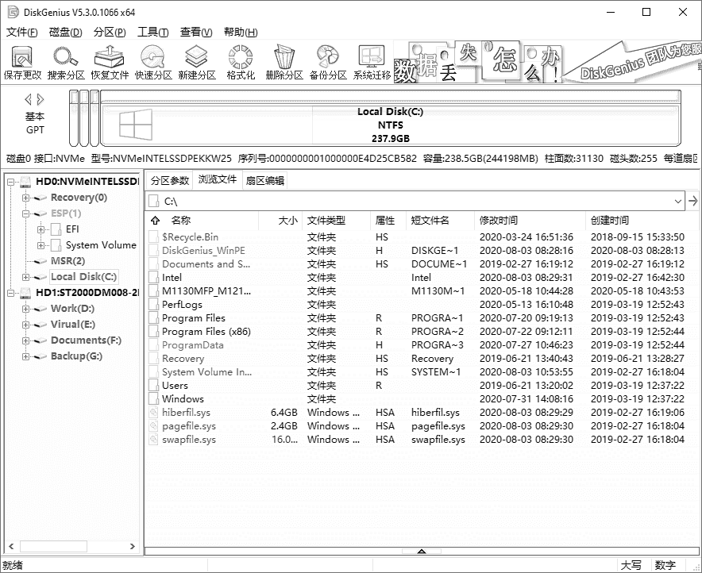

# 模块4 软件安装与调试

## 任务6 分区与格式化硬盘

### 4.1~4.4 低格、分区、高级格式化

#### 1.低级格式化

##### 一、定义：

硬盘的低级格式化，又称硬盘的物理格式化，其主要目的是划分磁道，建立扇区数和选择扇区的间隔比，即为每个扇区标注物理地址和扇区头标志，并以硬盘能识别的方式进行编码。

##### 二、三个零散点

①新硬盘在出厂时已进行低级格式化。

②低级格式化会缩短硬盘的使用寿命。

③什么情况下需要对硬盘进行低级格式化：坏道较多、无法通过杀毒软件清除计算机病毒。

##### 三、低格步骤

①常见低格工具：Lformat、DM、硬盘厂商低格工具、个别主板BIOS功能。

②使用DM对硬盘低格

i.用启动盘启动系统，运行DM，在出现的主界面中，单击“Utillites“按钮；

ii.选择”Zero Fill Drive（full）“，单击”Next“开始低级格式化整个硬盘；

iii.当低级格式化完成后，按”Ctrl+Alt+Del”组合键重启计算机。

#### 2.分区

##### 一、物理扇区CHS与逻辑扇区LBA

物理扇区：CHS（柱面、磁头、扇区）

逻辑扇区：将物理扇区编号，以方便使用。

##### 二、分区管理方式

分区表类型有MBR分区表和GPT分区表两种。查看步骤如下：

第一种方法（磁盘管理查看）：

①右击“计算机”图标，选择“管理”->“存储"->”磁盘管理“选项

②选择一个磁盘，右击，选择”属性“->"卷"选项，查看磁盘分区形式。

第二种方法（diskpart命令行查看）

①Win+R打开运行框。

②输入”cmd“回车。

③输入”diskpart“，回车等显示出”DISKPART>"。

④输入“list disk”，回车。

⑤在命令的输出信息中查看硬盘分区表类型。

###### MBR分区表模式

###### GPT分区表模式

①GUID磁盘分区表，全局唯一标识磁盘分区表（GUID Partition Table）。

②GPT可以很好地与UEFI（统一可扩展固件接口）配合。

③逻辑块地址LBA采用64位表示。

###### GPT分区表与MBR分区表的主要区别：

（1）支持的分区个数不同。

①MBR分区表最多支持划分4个主分区。

②GPT分区表原则上分区数不受限制，但在Windows中最大数量为128个。

（2）支持的硬盘大小不同。

①MBR分区表最大仅支持2TB的硬盘。

②GPT分区表最大支持18EB的硬盘。

（3）损坏后的严重程度不同。

①MBR的启动代码一旦损坏，系统就无法启动，只有通过修复才行。

②GPT在硬盘最后有分区表备份，减少了分区表损坏的风险。

（4）兼容性不同。

①MBR有较好的兼容性。

②GPT分区兼容性不如MBR，因此GPT存储了传统的MBR区，以防识别错误破坏硬盘数据。

##### 三、分区格式

##### 四、分区操作

常见分区软件有Disk Manager、Partition Magic和DiskGenius。

###### （1）建立分区

①选择需建立分区的空闲区域，单击工具栏“新建分区”按钮（或依次选择“分区->建立新分区"选项，或在空闲区域上右击选择”建立新分区“选项）。弹出”建立分区“对话框。

②按需选择分区类型、文件系统类型、输入分区大小后，单击”确定“即可建立分区。

为提高读写效率，应设置4k对齐（对齐到物理扇区数的整数倍）。勾选”对齐到下列扇区数的整数倍“。

③执行”保存分区表“命令。

###### （2）在已经建立的分区中建立新分区（无损分区）

①选中需要建立新分区的分区，右击并选择”建立新分区“选项。

②在弹出的”调整分区容量“对话框中，设置新建分区的位置与大小等参数，然后单击”开始“按钮。

###### （3）分区表格式转换

在需转换的硬盘上点右键”转换分区表类型为MBR格式（GPT格式）“。

#### 3.高级格式化

##### 一、零零碎

①操作系统把数据以文件为单位存储在硬盘上，”按名存取“。

②簇是操作系统进行文件数据读写操作的最小单位。

##### 二、利用操作系统自带的功能进行格式化

打开”计算机“窗口，右击要格式化的分区，在弹出的快捷菜单中，选择”格式化“命令。在弹出的”格式化磁盘“对话框中，选择”文件系统及格式化“选项，单击”开始“，即可对该盘进行格式化。

### 4.5 硬盘分区管理

#### 1.PartitionMagic硬盘分区魔术师

PM可进行的操作有：查看分区情况、创建新分区、调整现有分区容量、合并分区、格式化分区、复制分区、转换分区格式、删除分区、隐藏分区等。

##### （1）查看分区情况。

##### （2）创建新分区。

课本P98页。三步。

##### （3）调整现有分区的容量。

①在主界面左侧的“选择一个任务”栏，单击“调整一个分区的容量”选项。

②在弹出的“调整分区的容量”对话框中，单击“下一步”按钮，在“选择分区“对话框中选择需要调整的分区，单击”下一步“按钮。

③在弹出的”调整分区的容量“对话框中输入分区调整后的容量值，根据提示在调整范围的最大值和最小值之间输入需要调整的数值，单击”下一步“。如果增大容量，就会弹出”调整分区的容量“对话框；如果缩小容量，则弹出”提供给哪一个分区空间”对话框。

④增加分区容量时，选择将容量划给需扩充的分区，单击“下一步”确认，最后单击”完成“。

④减少分区容量时，勾选目标分区，单击”下一步“，进入”调整分区的容量“对话框，确认无误后，单击”完成“。如未勾选目标分区，则变成”未分配空间“区域。

##### （4）合并分区。

两个分区在磁盘上的位置必须相邻。

①选中需要进行合并的分区，右击，单击”合并“命令；或单击”分区→合并“选项。弹出”合并相邻的分区“对话框。

②在”文件夹名称“文本框中输入文件夹名称，单击”确定“完成。

##### （5）格式化分区。

选中需格式化的分区，右击，单击“格式化”选项。在弹出的“格式化分区”对话框中，单击“确定”，在单击“应用”按钮即可。

#### 2.Windows7的磁盘管理

（1）“磁盘管理”窗口的打开方法

①“控制面板→系统和安全→管理工具→创建并格式化硬盘分区”命令。

②运行“diskmgmt.msc”。

（2）新建主磁盘分区

①在磁盘上右击，选择"新建磁盘分区"，弹出”新建磁盘分区向导“。

②单击”下一步“，选择”主磁盘分区“。

③单击”下一步“，输入分区大小。

④单击”下一步“，指派驱动器号和路径。

⑤单击”下一步“，选择”按下面的设置格式化这个磁盘分区“，选择分区格式、簇大小、卷标。

⑥单击”下一步“，单击”完成“。

（3）建立扩展分区

在未指派空间上右击，建立扩展分区，单击”下一步“，完成。

（4）建立逻辑分区

①右击扩展分区的”可用空间“，选择”新建逻辑驱动器“。

②在弹出的”新建磁盘分区向导“对话框中，单击”下一步“，“选择分区类型”中选择“逻辑驱动器”。

③根据向导提示完成逻辑驱动器的创建。

## 任务7 安装操作系统

### 4.6 认识主流操作系统

#### 1.杂杂碎

①操作系统（OS）是管理和控制计算机硬件和软件资源的计算机程序。

②操作系统是用户和计算机的接口，是计算机硬件和软件的接口。

③计算机常见的操作系统有DOS、OS/2、Unix、XENIX、Linux、Windows、Netware等，具有并发性、共享性、虚拟性和不确定性4个基本特征。

#### 2.功能

操作系统的功能主要包括管理计算机系统的硬件、软件及数据资源，控制程序运行，提供人机交互界面，为其他软件提供支持，让计算机系统所有资源最大限度地发挥作用，为其他软件的开发提供必要的服务和相应的接口等。

### 4.7 安装Windows 7 操作系统

不输入密钥，只能试用30天。

### 4.8 Windows 7 操作系统升级至 Windows 10 操作系统

官方升级工具“易升”，会保留原来系统的数据及用户文件。

### 4.9 操作系统的备份与恢复

##### 1.Windows 7 操作系统备份与还原方法

###### （1）创建还原点

①右击系统桌面的”计算机“图标，在弹出的快捷菜单中单击”属性“。在弹出的”属性“窗口中，单击”系统保护“按钮。

②在打开的”系统属性“对话框中，单击”系统保护“选项卡，选择Win7系统所在的分区，单击”配置“按钮。

③在进入的“系统保护本地磁盘”对话框中，选中“还原系统设置和以前版本的文件”单选按钮，单击”确定“返回”系统属性“对话框。

④单击”创建“按钮，在弹出的”系统保护“对话框中输入识别还原点的描述信息，单击”创建“按钮即可成功创建系统还原点。

###### （2）系统还原

①打开”系统属性“对话框，单击”系统保护“选项卡。

②单击”系统还原“选区中的”系统还原“按钮。

③根据需要在”系统还原“对话框中，选择已创建的系统还原点，即可完成系统还原。

##### 2.使用Ghost软件对系统分区备份和恢复

###### （1）备份步骤

使用光盘引导启动计算机并运行Ghost软件→选择把分区内容备份成镜像文件操作方式→选择源分区→选择镜像文件存放目标盘→选择是否高压缩镜像文件→生成镜像文件。

###### （2）恢复步骤

使用光盘引导启动计算机并运行Ghost软件→选择从备份的镜像文件克隆到分区操作方式→选择源分区→选择目标驱动器的目标分区→恢复分区。

## 任务8 安装操作系统

### 4.10 驱动程序简介

#### 1.什么是驱动程序

操作系统不同，硬件的驱动程序也不同。驱动会不断升级。

#### 2.驱动程序的作用

驱动程序的作用是对BIOS不能支持的各种硬件设备进行解释，使计算机能够识别这些硬件设备，从而保证它们的正常运行。必需设备可被BIOS和操作系统直接支持，不在需要安装驱动。

#### 3.哪些情况下需要安装驱动程序

①新增或更换硬件设备。

②安装操作系统。

③设备出现故障。

#### 4.驱动程序的类型、来源

驱动程序安装前有：.exe格式、.inf格式。安装后有：sys、dll、vxd、drv、inf等格式。Windows上的驱动大多放在inf文件夹里。

来源：自带驱动、随机驱动程序、通过Internet下载与安装。

### 4.11 安装驱动程序

#### 1.驱动程序的安装顺序

(1)安装操作系统后，应安装操作系统的SP补丁包。

(2)安装主板驱动。

(3)安装DirectX驱动。

(4)安装显卡、声卡、网卡和调制解调器等插在主板上的板卡类驱动。

(5)最后安装打印机、扫描仪、手写板等外设驱动。

#### 2.驱动程序的安装方法

##### （1）系统检测自动安装。

Windows支持即插即用功能，当发现新设备，会弹出“硬件更新向导”，并自动安装该设备的驱动。如果不能识别，按下述方法安装。

##### （2）通过随机光盘进行安装。

①放入驱动光盘，当出现“硬件更新向导”时，指定驱动搜索位置为CD-ROM后，系统自动搜寻并安装。

②放入驱动光盘，找到Install或Setup.exe，双击运行，单击相应按钮即可。

##### （3）手动安装。

①使用AIDA64，检测该硬件，并去相应的硬件驱动网址下载安装。

②使用驱动精灵。

### 4.12 驱动程序的备份与还原

#### 1.驱动程序的备份

①单击驱动精灵程序中“驱动程序→备份还原”。

②勾选所需要备份驱动程序的硬件名称，选择需要备份的硬盘路径。

③单击“一键备份”按钮，即可完成驱动程序的备份工作。

#### 2.驱动程序的还原

①单击驱动精灵程序的“驱动程序→备份还原”。

②选择文件路径，找到备份的驱动程序，然后勾选所需要还原驱动程序的硬件名称。

③单击“还原”按钮，即可还原驱动程序。

#### 3.驱动程序的卸载

①单击驱动精灵程序的“驱动程序→驱动微调”

②勾选硬件名称，单击“卸载驱动”，即可完成卸载工作。

### 4.13 在Windows 10 操作系统中查看设备状态

#### 1.查看驱动程序

①右击桌面上的“计算机”图标，在弹出的快捷菜单中单击“属性“命令。

②在打开的”系统“窗口上，单击”设备管理器“按钮。

③在打开的”设备管理器“窗口中，展开相应的子菜单。

④右击相应硬件，在弹出的快捷菜单中选择”属性”命令，即可查看设备状态、驱动程序提供商、驱动程序日期和版本等信息。

#### 2.更新或卸载驱动程序

①右击桌面上的“计算机”图标，在弹出的快捷菜单中单击“属性“命令。

②在打开的”系统“窗口上，单击”设备管理器“按钮。

③在打开的”设备管理器“窗口中，展开相应的子菜单。

④右击相应硬件，在弹出的快捷菜单中选择”属性”命令。

⑤在打开的硬件驱动属性窗口中的”驱动程序“选项卡中，点击相应的按钮（更新驱动程序、禁用设备、卸载设备）。

