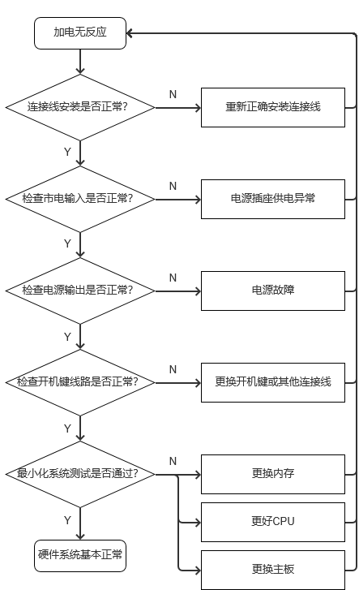

# 模块6 计算机故障诊断与排除

## 任务11 诊断计算机故障

### 6.1 计算机故障诊断原则

四个原则可以出问答题，要当心。

##### 1.”一切从简单的事情做起“原则

检修前，观察包括以下几个方面的内容：

①对计算机所表现的特征、显示内容的观察。

②对计算机内部环境情况的观察。

③对计算机的软硬件配置的观察。

④对计算机周围环境的观察。

##### 2.”先想后做“原则

##### 3.”先软后硬、由外到内“原则

##### 4.”抓核心问题“原则

### 6.2 计算机故障解决方法

##### 1.观察法

观察法主要是从以下三个方面检查、解决计算机故障：

①观察系统板卡的插头、插座是否歪斜，电阻、电容引脚是否相碰，表面是否烧焦，芯片表面是否开裂，主板上的铜箔是否烧断。还要查看是否有异物掉进主板的元器件之间(造成短路)，也可以看看板上是否有烧焦变色的地方，印刷电路板上的走线(铜箔)是否断裂等等。

②观察计算机所在的环境是否恰当（市电、温湿度、灰尘等），软件应用及驱动版本安装是否正常，软硬件匹配的兼容性是否合适，是否有错误的操作习惯等。

③通过简便的软硬件检测工具判断故障部件和故障原因。

##### 2.最小系统法

###### （1）硬件最小系统

由电源、主板、CPU、内存、显卡和显示器组成。

###### （2）软件最小系统

##### 3.逐步添加去除法

##### 4.替换法

替换法应尽量遵循的原则：

（1）根据观察故障发生的现象，来考虑需要进行替换的部件或设备。

（2）按替换部件的繁简程度进行替换。

（3）根据故障率来决定部件的替换顺序。首先考察和怀疑连接线接触是否良好、安装是否到位；其次替换怀疑有故障的部件；其次替换供电部件；最后与之相关的其他部件。

##### 5.诊断卡法

##### 6.释放电荷法

将主机断电（断开主机与电源的连接，笔记本还需去掉电池），然后连按2~3次主机电源开关，或者连续按住主机电源开关3秒。

##### 7.升降温法

### 6.3 计算机故障分析基础知识

##### 1.软件故障

是指由于计算机系统兼容性配置不当、感染病毒或操作人员使用操作不当等原因引起无法正常运行的故障现象。

（1）应用与应用，或应用与系统之间不兼容而引起的系统崩溃、蓝屏、死机、重启等现象。

（2）系统文件或驱动删除而引起系统崩溃、功能失效甚至无法启动系统等现象。

（3）系统中毒、系统文件遭到破坏造成无法正常运行的现象。

（4）多个杀毒互相冲突，导致系统运行卡顿、死机等现象。

##### 2.硬件故障

是指计算机硬件系统中内部硬件与外部硬件因使用不当而引起的接触不良、电路或器件损坏、硬件本身电性能下降等原因引起的故障现象。

（1）部件间的插口连接不匹配或接触不良。

（2）跳线设置错误引起的硬件之间发生冲突。

（3）由于硬件厂商的不同造成硬件与硬件之间互不兼容，引起计算机死机、蓝屏、无法启动等疑难故障。

（4）计算机使用一段时间后，设备部件的电性能下降、电路元器件虚焊、损坏引起功能失效，甚至无法正常启动工作的故障现象。

### 6.4 计算机故障分析流程

##### 1.计算机软件故障分析

BIOS设置造成找不到硬盘。

解决思路和处理方法：

（1）查看软件应用功能快捷键设置是否正确，如WiFi、蓝牙功能的启动与关闭。

（2）磁盘垃圾文件过多引起的计算机使用性能变差，建议定期清理。

（3）系统开机启动项太多影响开机速度和系统的稳定性，建议关闭一些不必要的启动项。

（4）通常只安装一个杀毒。

（5）系统盘剩余空间太少或打开的快速启动文件过多，拖慢整个系统的运行速度。

（6）如无法识别打印机等其他外设时，查看设备驱动是否正确安装。

（7）插卡应用软件的兼容性问题。如应用软件版本匹配问题、与操作系统是否兼容等。

（8）某些顽固病毒，可启动安全模式（F8）清除。

（9）安装更新或更改设置后导致系统无法正常启动时，可进入安全模式卸载此软件或恢复所更改的设置。

（10）可通过调整虚拟内存的大小和禁用多余的系统服务来提升计算机运行速度。

（11）查看BIOS设置参数是否正确。

（12）查看系统配置文件是否被破坏或删除导致系统崩溃，可通过重新设置或重装系统解决。

##### 2.计算机硬件故障分析

## 任务12 排除计算机故障

### 6.5 不开机故障的解决

##### 1.加电无反应硬件故障维修流程图

##### 2.系统故障主要有如下几个方面：

（1）CMOS电池电量不足

正常电压3V，解决方案：更换CMOS电池。

（2）BIOS设置错误

解决：“Load Fail →Safe Defaults”恢复出厂设置。

（3）操作系统故障

解决：开机按F8，选择“Safe Mode”进入安全模式，通过设备管理器和系统文件检查器（sfc）来查找故障。根据具体情况，重装驱动程序，或根据系统文件受损情况重新安装文件恢复。

### 6.6 死机故障的解决

##### 1.CPU散热器故障

主要原因：风扇滚珠轴承润滑油变少，导致风扇转速过慢；风扇灰尘过多或导热硅脂硬化。

检测方法：主机箱平放，打开侧盖，开机观察扇叶是否工作。若完全不转，故障确认；若转速低于正常值，进BIOS观察CPU FAN RPM转速值和CPU核心温度是否正常即可判断故障。也可指尖轻触风扇扇叶，若打手，表面工作正常，若立刻停转，表明风扇存在问题。

解决方案：更换CPU散热器或更换散热器上的风扇。

##### 2.显卡故障

主要原因：显卡接触不良、驱动程序出错、超频后故障和电子元器件故障。

检测方法：检查显卡接口卡扣是否扣紧、主板插槽或显卡本身是否存在污垢；显卡驱动程序安装是否正确；显卡过分超频引起系统无法启动或黑屏现象；显卡电子元器件故障需进行三级维修或直接更换整个显卡模块解决。

解决方案：清理灰尘，重新正确安装，更换或升级驱动程序，降低显卡频率，更换显卡。

##### 3.电源故障

主要表现：开机无反应，电压不稳引起自动重启，自动关机，死机，功率变小，机箱漏电等。

检测方法：使用万用表直流电压档测量电源输出端的各路电压是否正常；检查电源接地装置是否正确；检查电源内部灰尘是否过多。

解决方案：清理灰尘，正确安装接地装置，更换新电源。

##### 4.病毒、木马入侵导致系统资源耗尽

解决方案：加强系统维护，即使更新操作系统补丁，及时更新杀毒软件和防火墙软件，做到防患于未然。对于已感染病毒的系统则应使用新版杀毒软件进行查杀处理。

### 6.7 蓝屏故障的解决

##### 1.硬件方面

（1）超频过度

解决方案：提高散热系统效率或降低超频幅度，增强系统稳定性。

（2）内存发生物理损坏或内存与其他硬件不兼容

解决方案：逐一测试内存能否正常工作，更换有故障或不兼容的内存。

（3）系统硬件冲突

解决方案：在设备管理器中手动删除存在问题的设备，重启，由Windows系统自动调整。若仍未解决，手动进行调整或升级相应的驱动程序。

（4）劣质配件导致蓝屏

解决方案：合理选配硬件，对整机烧机测试，找出易发生故障的配件，将其更换后增强系统稳定性。

##### 2.软件方面

解决方案：具体问题具体分析，一般通过“任务管理器”、“设备管理器”、“磁盘清理”、“系统还原”、“注册表编辑器”、“重装系统”或其他工具软件加以修复。

### 6.8 黑屏故障的解决

##### 1.电源线、信号线连接故障

解决方案：正确连接电源线、信号线。电源线接触不良的可换用高品质线，显示器信号线接头螺丝要固定好。

##### 2.开机后CPU风扇转但黑屏

（1）主板BIOS有报警音

解决方案：如为内存接触不良或损坏，用橡皮擦拭金手指后重新安装，如故障依旧则更换内存条。

（2）主板BIOS没有报警音

检测方法：观察硬盘指示灯，看硬盘是否有读取操作。如系统正常启动，检测显示器。

解决方案：采用替换法确定显示器是否发生故障。

（3）主板硬盘指示灯常亮，或是长暗。

检测方法：将检查重点放在主机上，可尝试将内存、显卡、硬盘等配件逐一插拔来确认故障源。若全部试过，故障依旧，则推断CPU或主板有可能损坏。

解决方案：更换损坏配件。

##### 3.开机后CPU风扇不转且黑屏

建议操作步骤：

（1）将主板与机箱的连线全部拔下，短触电源开关连线PW_SW，如正常开机，则证明机箱开机和重启键问题，或者连线错误。

（2）扣CMOS电池或使用CMOS跳线，清空CMOS后，观察计算机是否可以正常启动。

（3）将所有数据线和电源线全部拔线，外部设备全部拔下，清除主板电源插座和插头灰尘后尝试开机。如果可以开机，再依次将其他设备安装到位，以确认故障源。确认后，更换故障配件解决问题。

（4）更换一个新电源，看计算机能否启动。

若仍无法启动，则可判断主板或CPU已烧坏。

### 6.9 重启故障的解决

##### 1.Reset重启按键没有回位导致反复重启

检测方法：将主板上的Reset_SW插针拔出，看故障是否依旧存在。如解除，则确定属于该原因。

解决方案：更换重启按钮。

##### 2.电网电压起伏过大导致重启

检测方法：用万用表检测电网电压是否稳定。

解决方案：加配UPS电源加以稳定。

##### 3.CPU风扇转速过低或CPU过热导致重启

检测方法：将BIOS恢复默认设置，关闭风扇转速和CPU过热保护。如果不再重启，即可确认此故障。

解决方案：更换大功率CPU风扇。

##### 4.主板电容漏液导致重启

检测方法：将机箱平放，查看主板上的电容顶部是否完全平整或存在凸起。

解决方案：更换主板，或单独更换相应电容。

##### 5.硬盘磁道损坏导致重启

检测方法：使用磁盘坏道检测软件（如victoria、MHDD等）对硬盘进行检测。

解决方案：先备份磁盘数据，然后使用磁盘坏道修复软件（如CHKDSK）修复。也可用MHDD对硬盘扫描，若发现物理磁道损坏的磁盘，建议不要用于存储关键数据。

### 6.10 典型故障案例

案例1：台式主机接入电源后自动开机。

分析：一是硬件问题；二是软件BIOS设置问题。

解决：①硬件问题通常是开机按键损坏或短路引起，可通过更换开机按键或电源解决，如果是主板开机线路故障，可通过维修或更换主板解决。②软件BIOS设置问题，进入BIOS设置界面，将电源选项设置中“PWRON After PWR_Fail”选项设置为"OFF"，将上电自启功能关闭，保存设置并退出。

案例2：台式主机死机后无法正常启动，只有通过重装系统才能启动。设备管理器里出现很多问号。

分析：一、接口损坏；二、接口接触不良。

解决：先重装系统、安装驱动程序，如仍未解决，则对主机进行维修。打开机箱，拔下外部设备，取出主板，进行主板清理。重新安装后问题仍不能解决，则为主板损坏，更换或维修主板。

**案例3：计算机频繁死机，在进行BIOS设置时也会出现死机。**

分析：通常是主板散热设计不良或主板Cache有问题。还有可能主板或CPU存在问题。

解决：关机后触摸主板上CPU周围元器件，如温度过高，更换大功率风扇；如果是Cache造成，则在BIOS设置中将Cache禁用即可。如仍未解决，则证明主板或CPU存在问题，更换主板或CPU。

案例4：无法保存BIOS设置的参数。

分析：主板电池电压不足或CMOS跳线设置错误。

解决：更换CMOS电池。如未解决，检测CMOS跳线，并正确跳线。如不是以上原因，则可判断主板电路存在问题，更换或维修主板。

案例5：台式机无法启动硬盘上的操作系统，进入系统界面。

分析：①硬盘系统引导模式不正确（MBR和GPT），②硬盘启动项设置错误。

解决：①Windows7以前的系统，采用MBR模式；Windows8以上系统采用GPT。②开机后进入BIOS设置界面，将系统盘设置为启动第一项后保存退出即可。

案例6：H110主板，i3-4170 CPU，普通200W电源。每次开机总要反复按几次开机键，才能点亮计算机。有时检测硬盘时就会停滞，重启一次就可以解决问题。

分析：电源功率不足。

解决：更换大品牌、大功率电源。

**案例7：开机进系统蓝屏，蓝屏代码：0x00000001A。**

分析：一、劣质配件导致故障，如硬盘有坏道，可以使用MHDD进行扫描。二、内存故障，使用内存诊断工具（MdSched.exe）。

解决：使用MHDD扫描，排除硬盘坏道故障。使用内存诊断工具，根据蓝屏代码确定故障为内存不兼容，更换内存条解决。

案例8：开机屏幕出现英文提示“Fan Error”报错，无法正常启动。

分析：根据提示，可判断风扇或主板存在硬件故障。

解决：拆机发现风扇连接线没插紧。重新进行插拔固定后，解决。

案例9：一台式机，开机进BIOS设置，除可以设置“用户口令”、“保存并退出”、“不保存并退出”3项，其余各项均无法进入。

分析：CMOS存储芯片损坏引起。

解决：尝试放电处理（拔除CMOS电池、短接CMOS电池正负极、CMOS清空跳线）。如果仍无法解决，尝试升级BIOS程序。如仍未解决，更换或维修主板。

**案例10：使用Win10一段时间后系统运行速度慢，打开任务管理器，CPU占用率达到100%。**

分析及解决：

①杀毒软件造成的故障。只装一个杀毒。

②驱动程序出错造成的故障。删除出现异常的驱动程序，从官网重新下载并安装稳定版驱动程序。

③计算机病毒或木马入侵造成的故障。使用正规杀毒彻杀并清理系统内存和磁盘上的病毒，然后重启计算机。

案例11：某台计算机，在BIOS界面查看MAC地址时显示“Not Available”，而在系统内通过命令查询MAC地址正常且联网使用无异常。

分析与解决：BIOS版本过低，通过官网下载，将BIOS升级到指定版本解决此问题。

案例12：一台Win10计算机，进入系统后桌面图标持续闪烁，变白后恢复原状，反复如此。

分析：可能是系统与安装的应用软件发生冲突引起的。

解决：单击“开始菜单→设置→应用→默认应用”，然后单击“重置未Microsoft推荐的默认值”下面的“重置”按钮。等待完成后看是否恢复正常。

**案例13：计算机开机时提示“Invaild system disk”（没有可用系统盘）。**

分析：开机时无法找到活动分区。

解决：重新激活系统分区。使用USB闪存盘启动到PE系统后运行DiskGenius，在硬盘列表中选中系统分区并右击，在弹出的快捷菜单中选择“激活当前分区”选项即可。

**案例14：系统分区引导记录没有错误，但每次启动时却出现“Bootmgr is missing, Press Ctrl+Alt+Delete to restart”的提示。**

分析；Windows的引导文件Bootmgr文件丢失。

解决：从与操作系统对应的系统安装盘的根目录中，复制Bootmgr到系统分区即可。如提示覆盖同名文件，同意。

**案例15：一台式机，H110M-F主板，DDR4 2400 4GB内存，WD1TB硬盘，板载声卡、网卡、显卡。在安装Win8原版系统时，提示“无法将Windows配置为在此计算机的硬件上运行”，无法继续进行安装。**

分析：系统在检测系统性能时出现了问题。

解决：当出现该对话框时，按“Shift+F10”，在弹出的命令窗口中输入“cd oobe”，回车后输入“msoobe.exe”，在弹出的对话框中根据提示完成设置即可。

案例16：一台新购台式机，开机提示“0135 Front FAN2 failure”报错信息。

解决：开机按F1进入BIOS，按F9根据提示加载默认值后，按F10保存并退出。

**案例17：系统内核文件出错，或者硬件、服务配置出错导致蓝屏。**

分析：该故障大多是病毒的侵袭，或者安装了不兼容的硬件（如虚拟光驱）造成。

解决：①尝试恢复配置。重启按F8进入高级启动选项，然后选择“最近一次的正确配置（高级）“选项，重启后查看是否再次出现类似故障。

②如故障依旧，尝试使用”安全模式“。开机按F8，选择”安全模式“，根据屏幕提示卸载不兼容的硬件驱动。

③如仍未解决，选择”修复计算机“命令进入WinRE，尝试使用”系统还原“功能修复。

④如仍未解决，还可以使用重装系统的方法来解决。

案例18：台式机在机器晃动时会出现间歇性黑屏故障，且机器会自动恢复而不会出现死机现象。

分析：主板出现松动或安装不到位。

解决：重装，将主板安装到位或加固螺丝。

**案例19：某台计算机，冷启开机时会出现花屏现象。但开机使用一段时间（15分钟左右）或重启后花屏故障消失。**

分析与解决：

开机花屏通常有两种表现。

①冷开机花屏。使用环境低于10℃时冷启，会出现花屏。将计算机从低温环境移至常温环境，并保持2小时以上再开机。

②间歇性花屏。首先核实在BIOS下是否花屏，若仍然存在，可确定是花屏硬件故障。通过外接显示器核实是显示端还是主机端故障。若在系统下故障复现率很高，而在BIOS下无法复现，可确认卸载集成显卡驱动后故障是否消失，如故障消失则务必恢复原厂系统测试。

