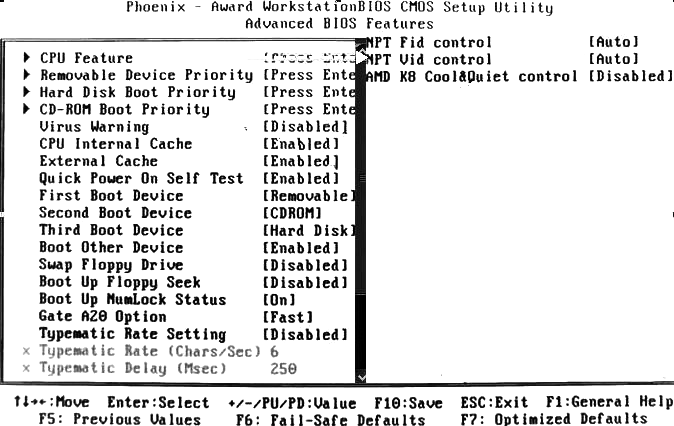
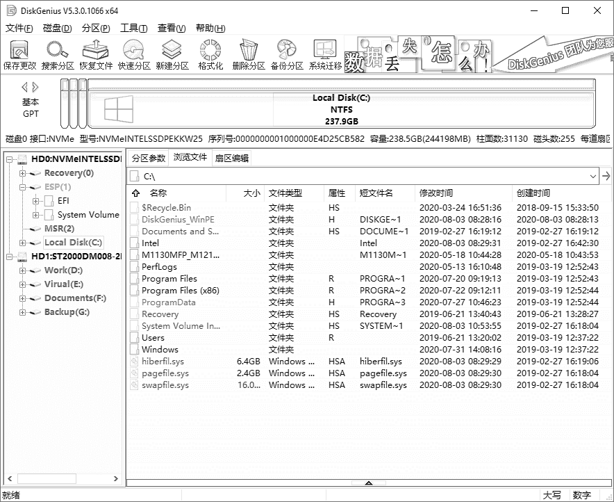

# 模块1 认识计算机

## 任务1 认识计算机系统的组成

### 1.1 计算机硬件系统

五个基本组成部分（**程序存储原理**）

### 1.2 计算机软件系统

计算机系统体系结构图

附：

*①操作系统软件：DOS、Linux、Windows。*

*②服务性程序：机器调试、故障检查、诊断程序、**杀毒软件**。*

*③数据库管理系统：SQL Server、Oracle、Informix。*

### 1.3 计算机发展史

第一台计算机：ENIAC（埃尼阿克）

IBM卖个人电脑业务（ThinkPad也是）给联想（Lenovo）。

首款图形用户界面（GUI）个人计算机为苹果（Apple）公司的Mac计算机，使用MacOS操作系统。

世界上第一台笔记本电脑为日本东芝的T1000。

常见典型的PC机有：台式计算机、笔记本电脑、一体机等。

平板电脑的主流操作系统：Windows、Android、IOS、HarmonyOS等。

PC的发展趋势：**体积微型化**、**资源网络化**、**处理智能化**。

## 任务2 认识计算机的基本配置

### 1.4 计算机基本配置

#### 1.主板

主板MainBoard，又称母板MotherBoard

##### （1）主要参数

主板芯片、处理器规格、内存规格、存储扩展、I/O接口、板型、软件管理、其他参数。

##### （2）主要功能（开机时主板工作过程）

主板在加电并收到电源的 Power_Good 信号后，由时钟电路产生系统复位信号，CPU 在复位信号的作用下开始执行 BIOS 中的 POST 程序。POST 一旦顺利通过，就开始操作系统的引导及接受用户的任务直至关机。在计算机的整个运行期间，主板的工作就是在芯片组、时钟、BIOS的统一配合下，完成 CPU 与内存、内存与外设，外设与外设间的数据传送。也可以说，主板的作用就是同步、传递数据。

##### （3）基本组成

**芯片**：芯片组、BIOS芯片、集成声/网卡芯片 等。

**内部接口**：CPU插座、内存插槽、PCI-E 16X、PCI-E 1X、SATA接口、前置面板插针、主板供电接口（24针）、CPU供电接口（8针）、风扇接口（FAN）。

**前置面板插针**：PWR_SW、RESET、PWR_LED、HDD_LED、SPEAKER。

**外部接口**：PS/2、USB、VGA、DVI、HDMI、RJ-46、Audio等。

##### （4）常见规格

①ATX				12in × 9.6in

②Mini-ATX	15cm × 15cm

③Micro-ATX	9.6in × 9.6in

④ITX					17cm × 17cm

##### （5）总线Bus

①数据总线：CPU与RAM之间。

②地址总线：RAM中存储的数据的地址。

③控制总线：一般常见的为USB Bus和1394 Bus。

④扩展总线：扩展槽和计算机。

⑤局部总线

##### （6）芯片组架构

①南北桥架构

②MCH+ICH（IHA）

③PCH架构 

④单芯片架构（SoC，System on Chip）

#### 2.CPU

中央处理器（CPU），内部结构大致可分为**控制单元**（CU）、**算术逻辑单元**（ALU）、**存储单元**（Cache，高速缓存）。

##### （1）主要参数

##### （2）工作原理

CPU是执行程序的部件，程序是由一条条指令组成的，可以提前存储在计算机内存中。基于“程序存储”原理的CPU运作可分为4个阶段：提取、解码、执行和写回。

##### （3）CPU基本参数

①主频。也叫时钟频率，单位MHz，用来表示CPU运算速度，但不代表CPU的全部性能。外频和倍频的乘积就是主频。

②外频。CPU的基准频率。

③前端总线（FSB）频率。CPU和北桥芯片之间数据总线的时钟频率。

④缓存。解决CPU与主存之间的速度差。

⑤总线宽度。地址总线宽度决定了CPU可访问的物理地址空间大小。

⑥封装形式。

**缓存的工作原理**：缓存的工作原理是当C PU 读取一个数据时，首先从缓存中查找，如果找到就立即读取并送给CPU处理；如果没有找到，从相对慢速的内存中读取并送给CP U 处理，同时把这个数据所在的数据块调入缓存中， 可以使得以后对整块数据的读取都从缓存中进行，不必再访问内存，以提高数据的访问速度。

##### （4）CPU内核

##### （5）Intel酷睿i系列命名规则

##### （6）超线程

超线程技术（Hyper-Threading，HT），是利用特殊的硬件指令，把单个物理核心模拟成两个逻辑核心，让每个核心都能使用线程级并行计算，进而兼容多线程操作系统和软件，减少了 CPU 的闲置时间，提高CPU 的运行效率。

#### 3.硬盘

#### （1）结构

①外部结构

②物理结构

③逻辑结构

每扇区，512B。

各分区可采用不同的分区类型，常见的有FAT(16、32)、NTFS等。

快速格式化仅清空FAT区和根目录区，不操作数据区，（删除和清空回收站亦然），因此可以通过数据找回软件找回。

##### （2）引导原理

①主引导扇区：0面0道1扇区，主引导记录MBR + 分区表DPT + 结束标志

主引导扇区位于整个硬盘的0磁头0柱面1扇区，包括硬盘主引导记录MBR和分区表DPT

主引导记录（MBR）的作用：检查分区表是否正确以及确定哪个分区为引导分区，并在程序结束时把该分区的启动程序（也就是操作系统引导扇区）调入内存加以执行。

分区表（DPT）作用：记录着硬盘的分区信息。

512字节的主引导扇区，MBR占了446字节，DPT占了64字节，2个字节的有效结束标志。

| 描述             | 尺寸（字节） |
| ---------------- | ------------ |
| 引导程序代码区域 | 446          |
| 分区表DPT        | 64           |
| 结束标志55AA     | 2            |

②分区的FAT文件系统结构

**i.操作系统引导记录OBR。**通常位于0面1道1扇区，包括一个引导程序和本分区参数记录表BPB。

引导程序：主要任务是判断本分区根目录前两个文件是否为操作系统的引导文件，如果是，就把第一个文件读入内存，并把控制权交予该文件。

BPB参数块：记录着本分区的起始扇区、结束扇区、文件存储格式、硬盘介质描述符、根目录大小、FAT 个数、分配单元的大小等重要参数。

OBR 由高级格式化程序产生。

**ii.文件分配表FAT。**为数据安全考虑，有两个。

**iii.目录区DIR。**记录着每个文件（目录）的起始单元、文件的属性。

**iv.数据区。**

为什么格式化分区后数据可以恢复：

通常所说的高级格式化程序，并没有把 DATA 区的数据清除，只是重写了FAT表和DIR表而已，至于分区硬盘，也只是修改了MBR 和 OBR，绝大部分的DATA 区的数据并没有被改变，这也是许多硬盘数据能够得以修复的原因。

##### （3）硬盘主要性能参数

①分类

&emsp;i.按尺寸：2.5 in、3.5 in。

&emsp;ii.按接口：IDE、SCSI、SATA

②容量

&emsp;硬盘容量 = 磁头数 × 柱面数 × 扇区数 × 512B

&emsp;硬盘容量 = 单碟容量 × 碟片数

③转速

单位rpm（Revolutions per minute）

④缓存

⑤平均寻道时间

⑥数据传输率

（4）固态硬盘SSD

结构：控制单元、存储单元。

优点：低功耗、无噪声、抗震动、低热量。缺点：成本高，损坏不可挽救。

#### 4.内存

##### （1）作用与分类

| 类型       | 电压             | 线数 |
| ---------- | ---------------- | ---- |
| SDRAM      | 3.3V             | 168  |
| DDR SDRAM  | 2.5V             | 184  |
| DDR2 SDRAM | 1.8V             | 240  |
| DDR3 SDRAM | 1.5V 1.35V 1.25V | 240  |
| DDR4 SDRAM | 1.2V（1.45V）    | 284  |
| DDR5 SDRAM | 1.1V（1.35V）    | 288  |

##### （2）主要性能指标

①存储容量②存取速度③工作频率④接口类型⑤CL设置

##### （3）双通道技术

#### 5.显卡

显卡又称显示适配卡，是连接主机与显示器的接口卡。其作用是将主机输出的信息转换成字符、图形和颜色等信息，传送到显示器上显示。

##### （1）结构及工作原理

**显卡工作原理：**

①将CPU送来的数据送到图形处理器（GPU）进行处理。

②将图形处理器处理完的数据送到显存。

③由显存读取出数据并送到RAMDAC进行数据转换工作（数字信号转换成模拟信号）

④将转换完的数据送到显示器显示。

##### （2）主要性能指标

①显存（速度、位宽、容量）

②显示核心GPU

③散热方式（被动散热、主动散热）

④显卡接口

⑤物理特性（渲染流水线、API、顶点着色单元、像素着色单元）

#### 6.声卡

声卡：集成声卡、独立声卡。软声卡、硬声卡。

独立显卡优点：较先进，更好的显示效果和性能，容易硬件升级。缺点：功耗和发热量大、占用扩展插槽、需额外购买。

#### 7.网卡NIC

传输介质：双绞线、同轴电缆、光纤。

双绞线采用RJ-45接口。

MAC地址写入ROM芯片中。

#### 8.显示器

CRT：阴极射线管显示器。

LCD：液晶显示器。

LED：采用LED发光二极管的液晶显示器。

##### 液晶显示器工作原理

液晶显示器工作时，背光源（灯管）射出光线经过一个偏光板，然后再经过液晶，到达前方的彩色滤光片与另一块偏光板。根据其间电压的变化控制液晶分子的排列方式实现不同的光线强度与色彩，从而在液晶显示屏上形成丰富多彩的图像效果。

##### 液晶显示器主要性能参数

①点距和可视面积

②最佳分辨率和刷新率

③亮度

④对比度

⑤响应时间

⑥可视角度

⑦最大显示色彩数

⑧点缺陷（亮点、暗点、坏点）

#### 9.其他设备

##### （1）机箱

立式、卧式。ATX、Micro-ATX、NLX。

##### （2）无线技术

①蓝牙：2.4~2.485GHz的UHF无线电波。

②无线键盘/鼠标：红外、蓝牙。

无线通信方式：蓝牙、WiFi（IEEE802.11）、Infared（IrDA）、ZigBee（IEEE 802.15.4)。

##### （3）音箱：倒相式、密闭式。

##### （4）光驱

光盘种类：CD-ROM、CD-R、CD-RW。

①结构：手动退盘孔…

②工作原理

光驱在读取信息时，激光头会向光盘发出激光束，当激光束照射到光盘的凹面或非凹面时，反射光束的强弱会发生变化，光驱就根据反射光束的强弱，把光盘上的信息还原成数字信息，即“0”或“1”，再通过相应的控制系统，把数据传给计算机。

##### （5）打印机

按打印原理分为：针式打印机、喷墨打印机、激光打印机。

喷墨打印机：墨水、喷头。

激光打印机：碳粉、磁鼓。

##### （6）扫描仪

从原理分：CCD、CIS。

##### （7）U盘

采用Flash Memory存储技术的USB设备。

##### （8）摄像头

摄像头一般具有视频摄影和静态图像捕捉等功能，是借由镜头采集图像后，由摄像头内的感光组件电路及控制组件对图像进行处理，并转换成计算机所能识别的数字信号，然后借由并行端口或USB端口连接输入计算机后由软件再进行图像还原。

##### （9）麦克风Microphone

### 1.5 计算机主要端口

#### 1.常见多媒体端口

（1）高清多媒体接口HDMI：可发送未压缩音频及视频信号。

（2）数字视频接口DVI。DVI-A、DVI-D、DVI-I。

（3）视频图形阵列接口VGA，3排15针。

（4）雷电接口Thunderbolt

双向10Gbps，可传输视频、音频、数据。可兼容Mini DP。

（5）高清数字显示端口DP（DisplayPort），传输音频和视频。

（6）MiniDP

（7）AV端口。莲花头，黄白红三色。黄接视频、白红分布负责左右声道。

（8)S端子S-Video。4或7针，2亮度，2色度，1接地。

（9）S/PDIF端口

（10）分量端口

#### 2.通用串行总线USB

USB特点：传输速度快、使用方便、支持热插拔、连接灵活、独立供电、兼容性好。

**USB如何实现热插拔**：USB接口内部的4根金手指，外侧2根供电线长，内侧2根数据传输线短。当插入设备时，外侧电源线首先连接供电，保证中间的数据线在通电状态下进行数据交换；当拔出设备时，先断开数据传输，保证数据不会因断电而丢失，然后再将设备电压切断。

| 类型    | 速率     | 插针 | 电压       | 其他         |
| ------- | -------- | ---- | ---------- | ------------ |
| USB 1.0 | 1.5 Mb/s | 4    | 5V         | 白色         |
| USB 1.1 | 12 Mb/s  | 4    | 5V         | 白色         |
| USB 2.0 | 480 Mb/s |      | 5V         | 白/黑色      |
| USB 3.0 | 5.0 Gb/s | 9    | 5V         | 蓝色         |
| USB 3.1 | 10 Gb/s  | 9    | 5V/12V/20V | 最大功率100W |

USB OTG：USB On-To-Go。

Always on USB：断电后USB仍可供电。

参考资料：

# 模块2 计算机硬件安装与调试

## 任务3 设计装机方案

### 2.1 计算机配件的选购搭配原则

#### 1.计算机配件的选购原则

①按需配置②衡量装机预算③衡量整机运行速度

#### 2.计算机配件选购注意事项

①主要部件应尽量选主流品牌。②配件选择要容易修换、升级。③配件选购尽量找代理。

#### 3.计算机主要部件的搭配

①CPU与主板的搭配。②内存与主板的搭配。③显卡与主板的搭配。④硬盘与主板的搭配。

### 2.2 准备工作

#### 1.检查并熟悉配件（材料准备）

①检查配件是否齐全。②仔细检查各配件，主板是否物理损坏变形，CPU针脚是否弯曲、断落，盘体、金手指等是否有划痕。③认真阅读配件使用说明书，并对照实物熟悉各配件。

#### 2.准备安装用的工具（工具准备）

螺丝刀、尖嘴钳、散热膏、万用多孔电源插座、数字万用表。

### 2.3 安装注意事项

**1.释放人体所带静电。**要戴上防静电手套和手环，并保持接地良好。

**2.禁止带电操作。**装备过程一定要断电操作。

**3.阅读产品说明书。**应仔细阅读各配件产品说明书，确认是否有特殊的安装要求。

**4.使用正确的安装方法，不要强行安装。**要轻拿轻放各部件，不要堆压、碰撞，不要强行安装位置不到位的设备。

**5.防止液体进入计算机内部。**严禁液体进入板卡，避免汗水沾湿板卡造成短路。

## 任务4 组装计算机

### 2.4 组装步骤（技术准备）

#### 1.硬件装机流程

①准备好机箱并安装电源

②安装CPU/风扇。③安装内存。④安装主板。

⑤安装驱动器。⑥安装板卡。⑦安装机箱与主板间的连线。

⑧安装输入设备。⑨安装输出设备。

⑩重新检查连接线。⑪给计算机通电，如能点亮，进入BIOS进行系统初始设置。

#### 2.部件安装过程

##### （1）CPU、CPU风扇安装

①拉起主板CPU压杆，将口盖翘起。

②利用凹凸槽，对准CPU插槽放入CPU。

③将压杆轻轻下压，注意微调口盖，利用压杆末端的弯曲处牢固扣入扣点内。

④整理风扇。不要让风扇在运行时与线产生接触。

⑤调节散热器位置。将四个风扇扣柱底部与主板上的扣点对齐。

⑥用“对角线”法按压扣具。

⑦连接风扇电源供电。

##### （2）内存安装

①操作前带上防静电手环，并保持接地良好。

②将内存插槽两端的白色卡子向两边扳动，使其处于打开状态。

③将内存条的凹槽对准内存插槽的凸点，均匀用力将内存压入内存插槽，使插槽两边的卡子自动卡住内存条。

④如多根内存需打开双通道。将两条规格相同的内存条插入相同颜色的插槽上，就会打开双通道功能。

##### （3）主板安装

①操作前带上防静电手环，并保持接地良好。

②把主板小心放在底板上，并将主板背板接口与机箱背板I/O挡板的孔对齐，使所有螺丝对准主板的固定孔，并依次拧紧螺丝。

③螺丝安装完成后，应查看主板与底板是否平行，未搭接短路。

##### （4）安装扩展卡

①操作前带上防静电手环，并保持接地良好。

②找到主板的PCI-E插槽，将板卡垂直插入主板PCI-E插槽中。

③用螺丝固定显卡。

##### （5)硬盘安装

①操作前带上防静电手环，并保持接地良好。

②拉动固定扳手取下硬盘托架。

③将硬盘装入托架中，并拧紧螺丝。

④将托架重新装入机箱，并将扳手拉回原位固定。

⑤用数据线连接硬盘与主板，并连接硬盘电源线。

##### （6）安装各配件时需注意的问题

①固定螺丝时为避免滑丝，请勿拧紧螺丝，等所有螺丝都到位后再逐一拧紧。

②不要用力按压CPU，不要用手触摸CPU和插座的金属触点，以免造成部件损坏。

③安装双通道内存时，要将内存条安装在同一种颜色的内存插槽上。不同规格的内存尽量不要混用，以免造成系统不稳定。

④主板一定要与机箱底板平行，不能搭在一起，否则容易造成短路。

### 2.5 组装后的检查与调试

##### 1.通电前的检查

①检查主板上是否有掉落的螺丝或其他杂物，主板的固定是否到位，内存条及各种板卡是否安装到位，各类接口的连接线是否安装正确。

②检查各个驱动器、键盘、鼠标、显示器的电源线、数据线是否连接好。

③检查电源线与信号线是否分类捆扎并避开散热器及散热风扇出风口。

④通电前先进行电荷释放（未接通电源的情况下连续按开机键3次或持续按3秒）。

⑤检查各个电源插头是否插好。

##### 2.通电调试

（1）风扇转、电源指示灯亮==>电源。冒烟、焦味-->拔电。

（2）显示器指示灯亮==>显示器供电。

（3）屏幕显示、声音（报警声等）。“嘀”。

（4）硬盘灯亮闪。

（5）复位键正常。

（6）检查、固定。

### 2.6 组装过程常见故障与排解

（1）开机后计算机没有任何反应

可能原因：电源、开关、连线、主板、CPU等。

（2）开机后计算机的电源已经通电了，机箱面板的POWER灯、硬盘灯都亮，但是显示器不亮，只有橘红色的显示器指示灯在闪烁，但无声音提示。

可能原因：显示器、显卡、CPU、CMOS跳线。

（3）新组装的计算机，在服务商那里一切正常，回家后连接电源，显示器不显示，主机正常运行。

可能原因：主机与显示器连接数据线没有接对或内存松动。

（4）开机后计算机自动重启。

可能原因：电源、RESET按钮、主板。

（5）开机后，显示器无显示，但有报警声。

可能原因：根据报警声音来判断故障部位。

（6）开机后屏幕出现“Keyboard error or no keyboard present”的提示。

可能原因：键盘接口或键盘有问题。

（7）前置音频、USB无效。

可能原因：前置音频线、USB连线未连接或连接错误。

（8）CPU风扇声音过大或开机后一直狂转。

可能原因：散热硅脂问题、风扇本身质量问题、温度传感器问题。

（9）开机自检后死机，或者玩游戏时会自动退出、蓝屏。

可能原因：通常由于超频引起。

（11）开机后系统无法识别到硬盘，或者进入系统时间过长。

可能原因：硬盘电源线或数据线未接好，BIOS设置异常。

（12）由于显卡的原因造成黑屏、死机、屏闪。

可能原因：显卡驱动丢失，显卡安装接触不良，显卡与主板不兼容。

# 模块3 BIOS基本设置

## 任务5 进行BIOS设置

### 3.1 BIOS 与 CMOS 的区别

##### 1.认识 BIOS

BIOS，基本输入/输出系统

##### 2.认识 CMOS

CMOS，互补金属氧化物半导体，通常指主板上的一块可读写的RAM芯片，存储了计算机系统的实时时钟信息和硬件配置信息等。现在一般集成在南桥芯片中。

##### 3.BIOS 与 CMOS 的区别

①BIOS是一组固化在主板上只读存储器芯片中的管理计算机基本硬件的程序；CMOS是主板上的一块可读写的RAM芯片，是系统参数存放的地方，主板上的后备电池为其供电。

②计算机系统启动时，BIOS程序读取CMOS中的信息，初始化计算机各部件的状态。

③通过BIOS设置程序对CMOS参数进行设置。

### 3.2 BIOS 基本功能

##### 1.自检及初始化

①POST加电自检②初始化③引导程序。

##### 2.程序服务处理和硬件中断处理

常见中断号：10H视频服务，05H屏幕打印，14H磁盘及串口服务。

### 3.3 BIOS 自检响铃的含义

Award BIOS自检响铃的含义

| 响铃     | 含义                               |
| -------- | ---------------------------------- |
| 1短      | 正常启动                           |
| 1长1短   | RAM或主板出错                      |
| 1长2短   | 显示器或显示卡错误                 |
| 1长3短   | 键盘控制器错误                     |
| 1长9短   | 主板Flash RAM或EPROM错误，BIOS损坏 |
| 不断长响 | 内存条未插好或损坏                 |
| 重复短响 | 电源存在问题                       |

### 3.4 设置 BIOS 参数

##### 1.如何进入 BIOS 设置

Award按Del进入BIOS设置。

##### 2.Phoenix-Award 的 BIOS 设置

Phoenix-Award BIOS主菜单的含义说明

| 序号 | 菜单                      | 含义                 |
| ---- | ------------------------- | -------------------- |
| 1    | Standard CMOS Features    | 标准CMOS功能设定     |
| 2    | Advanced BIOS Features    | 高级BIOS功能设定     |
| 3    | Advanced Chipset Features | 高级芯片组功能设定   |
| 4    | Integrated Peripherals    | 外围设备设定         |
| 5    | Power Management Setup    | 电源管理设定         |
| 6    | PNP/PCI Configurations    | 即插即用/PCI参数设定 |
| 7    | PC Health Status          | PC健康状态           |
| 8    | Frequency/Voltage Control | 频率/电压控制        |
| 9    | Load Fail-Sefe Defaults   | 载入最安全的缺省值   |
| 10   | Load Optimized Defaults   | 载入最优性能缺省值   |
| 11   | Set Supervisor Password   | 设置超级用户密码     |
| 12   | Set User Password         | 设置普通用户密码     |
| 13   | Save & Exit Setup         | 保存后退出           |
| 14   | Exit Without Saving       | 不保存退出           |

###### Standard CMOS Features  

有日期、时间、外存、视频格式、挂起方式等的设置。

注意点：

①没有星期设置

②挂起方式（Halt On）：All Errors（任何错误都停）、No Errors（都不停）、All But Keyboard（键盘不停，其他停）、All But Diskette（磁盘不停，其他停）、All But Disk/Key（磁盘和键盘错误不停，其他停）。

###### Advanced BIOS Features

Hard Disk Boot Priority：多硬盘启动优先顺序。

Virus Warning：病毒报警。改MBR、DPT、OBR时暂停报警。

Quick Power On Self Test：快速检测（POST）设置。

First Boot Device：第一启动设备。

Boot Up NumLock Status：初始数字小键盘状态。

Security Option：安全菜单。System，开机就要密码；Setup，进入CMOS设置才要密码。

###### Integrated Peripherals

Onboard Lan Chip：板载网卡芯片开关。

OnChip USB：板载USB芯片模式设置。

USB Keyboard Support：DOS或BIOS下，USB键盘支持。

HD Audio：板载声卡开关。

PWRON After PWR-Fail：断电后重新来电后，系统自动开机。

#### 知识扩展

##### BIOS常见错误信息和解决方法

(1)CMOS battery failed：CMOS电池失效。

分析解决：CMOS电池电力不足，更换新电池。

(2)CMOS check sum error - Defaults loaded：CMOS求和校验错误-默认值已加载。

分析解决：电池电力不足，更换电池。如故障依旧，CMOS RAM有问题，主板返厂处理。

(3)Display switch is set incorrectly：显示开关配置错误。

分析解决：显示输出的BIOS设置与物理连接不符，更改设置或视频输出口。

(4)Press ESC to skip memory test：按ESC跳过内存测试。

分析解决：BIOS内开启Quick Power On Self Test功能。

(5)Secondary Slave hard fail：第二从盘失败。

分析解决：CMOS设置不当，硬盘数据线未接好，硬盘跳线设置不当。

(6)Override enable - Defaults loaded：超控出现，默认值被加载。

分析解决：BIOS设置不适合计算机硬件，进入BIOS重新调整。

(7)Press F1 to Continue, Del to setup：按F1继续，Del进CMOS设置。

(8)Memory test fail：内存测试失败。

分析解决：内存不兼容或有故障。分批依次插入各条内存，找出有故障的内存。

(9)hard disk install failure：硬盘安装失败。

分析解决：硬盘电源线或数据线未接好，或硬盘跳线设置不当。可以检测各连线是否插好，硬盘跳线设置是否正确。

(10)Press TAB to show POST screen：按TAB键显示POST屏幕。

##### EC 基本概念和特点

EC，电源管理芯片（或嵌入式控制器），是一个16位的单片机，笔记本独有，用来进行电源管理和键盘控制的功能芯片。

功能（了解，不用背）：

①笔记本键盘、鼠标、风扇转速的控制。

②在系统进入睡眠、休眠或关机状态下，实现系统智能电池的电量侦测、充放电控制。

③主机工作状态指示和快捷按键控制。

④控制系统的待机、休眠等状态。

##### UEFI 基本概念和特点

UEFI，统一可扩展固件接口，是操作系统与系统固件之间的软件接口，BIOS的替代方案。负责POST加电自检、联系操作系统、提供操作系统与硬件的接口。

与BIOS区别点：用模块化、C语言风格的参数堆栈传递方式，动态链接的形式构建系统。更易于实现，容错和纠错能力强，缩短研发时间。运行于32或64位模式，达到处理器最大寻址。利用加载EFI驱动的形式，识别与驱动硬件。支持图形界面，支持鼠标甚至触控操作，支持大容量硬盘 。

##### 常考BIOS设置操作

①开机密码设置。设俩密码和Security Option。

②设开机启动设备。第一启动项设置。

③装系统前bios设置。关病毒报警，设第一启动项。

④新主板装机。日期时间设置，加上③。

⑤禁/启用各集成芯片（声卡、网卡）。

⑥通电自动开机设置、USB相关项设置。

# 模块4 软件安装与调试

## 任务6 分区与格式化硬盘

### 4.1~4.4 低格、分区、高级格式化

#### 1.低级格式化

##### 一、定义：

硬盘的低级格式化，又称硬盘的物理格式化，其主要目的是划分磁道，建立扇区数和选择扇区的间隔比，即为每个扇区标注物理地址和扇区头标志，并以硬盘能识别的方式进行编码。

##### 二、三个零散点

①新硬盘在出厂时已进行低级格式化。

②低级格式化会缩短硬盘的使用寿命。

③什么情况下需要对硬盘进行低级格式化：坏道较多、无法通过杀毒软件清除计算机病毒。

##### 三、低格步骤

①常见低格工具：Lformat、DM、硬盘厂商低格工具、个别主板BIOS功能。

②使用DM对硬盘低格

i.用启动盘启动系统，运行DM，在出现的主界面中，单击“Utillites“按钮；

ii.选择”Zero Fill Drive（full）“，单击”Next“开始低级格式化整个硬盘；

iii.当低级格式化完成后，按”Ctrl+Alt+Del”组合键重启计算机。

#### 2.分区

##### 一、物理扇区CHS与逻辑扇区LBA

物理扇区：CHS（柱面、磁头、扇区）

逻辑扇区：将物理扇区编号，以方便使用。

##### 二、分区管理方式

分区表类型有MBR分区表和GPT分区表两种。查看步骤如下：

第一种方法（磁盘管理查看）：

①右击“计算机”图标，选择“管理”->“存储"->”磁盘管理“选项

②选择一个磁盘，右击，选择”属性“->"卷"选项，查看磁盘分区形式。

第二种方法（diskpart命令行查看）

①Win+R打开运行框。

②输入”cmd“回车。

③输入”diskpart“，回车等显示出”DISKPART>"。

④输入“list disk”，回车。

⑤在命令的输出信息中查看硬盘分区表类型。

###### MBR分区表模式

###### GPT分区表模式

①GUID磁盘分区表，全局唯一标识磁盘分区表（GUID Partition Table）。

②GPT可以很好地与UEFI（统一可扩展固件接口）配合。

③逻辑块地址LBA采用64位表示。

###### GPT分区表与MBR分区表的主要区别：

（1）支持的分区个数不同。

①MBR分区表最多支持划分4个主分区。

②GPT分区表原则上分区数不受限制，但在Windows中最大数量为128个。

（2）支持的硬盘大小不同。

①MBR分区表最大仅支持2TB的硬盘。

②GPT分区表最大支持18EB的硬盘。

（3）损坏后的严重程度不同。

①MBR的启动代码一旦损坏，系统就无法启动，只有通过修复才行。

②GPT在硬盘最后有分区表备份，减少了分区表损坏的风险。

（4）兼容性不同。

①MBR有较好的兼容性。

②GPT分区兼容性不如MBR，因此GPT存储了传统的MBR区，以防识别错误破坏硬盘数据。

##### 三、分区格式

##### 四、分区操作

常见分区软件有Disk Manager、Partition Magic和DiskGenius。

###### （1）建立分区

①选择需建立分区的空闲区域，单击工具栏“新建分区”按钮（或依次选择“分区->建立新分区"选项，或在空闲区域上右击选择”建立新分区“选项）。弹出”建立分区“对话框。

②按需选择分区类型、文件系统类型、输入分区大小后，单击”确定“即可建立分区。

为提高读写效率，应设置4k对齐（对齐到物理扇区数的整数倍）。勾选”对齐到下列扇区数的整数倍“。

③执行”保存分区表“命令。

###### （2）在已经建立的分区中建立新分区（无损分区）

①选中需要建立新分区的分区，右击并选择”建立新分区“选项。

②在弹出的”调整分区容量“对话框中，设置新建分区的位置与大小等参数，然后单击”开始“按钮。

###### （3）分区表格式转换

在需转换的硬盘上点右键”转换分区表类型为MBR格式（GPT格式）“。

#### 3.高级格式化

##### 一、零零碎

①操作系统把数据以文件为单位存储在硬盘上，”按名存取“。

②簇是操作系统进行文件数据读写操作的最小单位。

##### 二、利用操作系统自带的功能进行格式化

打开”计算机“窗口，右击要格式化的分区，在弹出的快捷菜单中，选择”格式化“命令。在弹出的”格式化磁盘“对话框中，选择”文件系统及格式化“选项，单击”开始“，即可对该盘进行格式化。

### 4.5 硬盘分区管理

#### 1.PartitionMagic硬盘分区魔术师

PM可进行的操作有：查看分区情况、创建新分区、调整现有分区容量、合并分区、格式化分区、复制分区、转换分区格式、删除分区、隐藏分区等。

##### （1）查看分区情况。

##### （2）创建新分区。

课本P98页。三步。

##### （3）调整现有分区的容量。

①在主界面左侧的“选择一个任务”栏，单击“调整一个分区的容量”选项。

②在弹出的“调整分区的容量”对话框中，单击“下一步”按钮，在“选择分区“对话框中选择需要调整的分区，单击”下一步“按钮。

③在弹出的”调整分区的容量“对话框中输入分区调整后的容量值，根据提示在调整范围的最大值和最小值之间输入需要调整的数值，单击”下一步“。如果增大容量，就会弹出”调整分区的容量“对话框；如果缩小容量，则弹出”提供给哪一个分区空间”对话框。

④增加分区容量时，选择将容量划给需扩充的分区，单击“下一步”确认，最后单击”完成“。

④减少分区容量时，勾选目标分区，单击”下一步“，进入”调整分区的容量“对话框，确认无误后，单击”完成“。如未勾选目标分区，则变成”未分配空间“区域。

##### （4）合并分区。

两个分区在磁盘上的位置必须相邻。

①选中需要进行合并的分区，右击，单击”合并“命令；或单击”分区→合并“选项。弹出”合并相邻的分区“对话框。

②在”文件夹名称“文本框中输入文件夹名称，单击”确定“完成。

##### （5）格式化分区。

选中需格式化的分区，右击，单击“格式化”选项。在弹出的“格式化分区”对话框中，单击“确定”，在单击“应用”按钮即可。

#### 2.Windows7的磁盘管理

（1）“磁盘管理”窗口的打开方法

①“控制面板→系统和安全→管理工具→创建并格式化硬盘分区”命令。

②运行“diskmgmt.msc”。

（2）新建主磁盘分区

①在磁盘上右击，选择"新建磁盘分区"，弹出”新建磁盘分区向导“。

②单击”下一步“，选择”主磁盘分区“。

③单击”下一步“，输入分区大小。

④单击”下一步“，指派驱动器号和路径。

⑤单击”下一步“，选择”按下面的设置格式化这个磁盘分区“，选择分区格式、簇大小、卷标。

⑥单击”下一步“，单击”完成“。

（3）建立扩展分区

在未指派空间上右击，建立扩展分区，单击”下一步“，完成。

（4）建立逻辑分区

①右击扩展分区的”可用空间“，选择”新建逻辑驱动器“。

②在弹出的”新建磁盘分区向导“对话框中，单击”下一步“，“选择分区类型”中选择“逻辑驱动器”。

③根据向导提示完成逻辑驱动器的创建。

## 任务7 安装操作系统

### 4.6 认识主流操作系统

#### 1.杂杂碎

①操作系统（OS）是管理和控制计算机硬件和软件资源的计算机程序。

②操作系统是用户和计算机的接口，是计算机硬件和软件的接口。

③计算机常见的操作系统有DOS、OS/2、Unix、XENIX、Linux、Windows、Netware等，具有并发性、共享性、虚拟性和不确定性4个基本特征。

#### 2.功能

操作系统的功能主要包括管理计算机系统的硬件、软件及数据资源，控制程序运行，提供人机交互界面，为其他软件提供支持，让计算机系统所有资源最大限度地发挥作用，为其他软件的开发提供必要的服务和相应的接口等。

### 4.7 安装Windows 7 操作系统

不输入密钥，只能试用30天。

### 4.8 Windows 7 操作系统升级至 Windows 10 操作系统

官方升级工具“易升”，会保留原来系统的数据及用户文件。

### 4.9 操作系统的备份与恢复

##### 1.Windows 7 操作系统备份与还原方法

###### （1）创建还原点

①右击系统桌面的”计算机“图标，在弹出的快捷菜单中单击”属性“。在弹出的”属性“窗口中，单击”系统保护“按钮。

②在打开的”系统属性“对话框中，单击”系统保护“选项卡，选择Win7系统所在的分区，单击”配置“按钮。

③在进入的“系统保护本地磁盘”对话框中，选中“还原系统设置和以前版本的文件”单选按钮，单击”确定“返回”系统属性“对话框。

④单击”创建“按钮，在弹出的”系统保护“对话框中输入识别还原点的描述信息，单击”创建“按钮即可成功创建系统还原点。

###### （2）系统还原

①打开”系统属性“对话框，单击”系统保护“选项卡。

②单击”系统还原“选区中的”系统还原“按钮。

③根据需要在”系统还原“对话框中，选择已创建的系统还原点，即可完成系统还原。

##### 2.使用Ghost软件对系统分区备份和恢复

###### （1）备份步骤

使用光盘引导启动计算机并运行Ghost软件→选择把分区内容备份成镜像文件操作方式→选择源分区→选择镜像文件存放目标盘→选择是否高压缩镜像文件→生成镜像文件。

###### （2）恢复步骤

使用光盘引导启动计算机并运行Ghost软件→选择从备份的镜像文件克隆到分区操作方式→选择源分区→选择目标驱动器的目标分区→恢复分区。

## 任务8 安装驱动程序

### 4.10 驱动程序简介

#### 1.什么是驱动程序

操作系统不同，硬件的驱动程序也不同。驱动会不断升级。

#### 2.驱动程序的作用

驱动程序的作用是对BIOS不能支持的各种硬件设备进行解释，使计算机能够识别这些硬件设备，从而保证它们的正常运行。必需设备可被BIOS和操作系统直接支持，不在需要安装驱动。

#### 3.哪些情况下需要安装驱动程序

①新增或更换硬件设备。

②安装操作系统。

③设备出现故障。

#### 4.驱动程序的类型、来源

驱动程序安装前有：.exe格式、.inf格式。安装后有：sys、dll、vxd、drv、inf等格式。Windows上的驱动大多放在inf文件夹里。

来源：自带驱动、随机驱动程序、通过Internet下载与安装。

### 4.11 安装驱动程序

#### 1.驱动程序的安装步骤

(1)安装操作系统后，应安装操作系统的SP补丁包。

(2)安装主板驱动。

(3)安装DirectX驱动。

(4)安装显卡、声卡、网卡和调制解调器等插在主板上的板卡类驱动。

(5)最后安装打印机、扫描仪、手写板等外设驱动。

#### 2.驱动程序的安装方法

##### （1）系统检测自动安装。

Windows支持即插即用功能，当发现新设备，会弹出“硬件更新向导”，并自动安装该设备的驱动。如果不能识别，按下述方法安装。

##### （2）通过随机光盘进行安装。

①放入驱动光盘，当出现“硬件更新向导”时，指定驱动搜索位置为CD-ROM后，系统自动搜寻并安装。

②放入驱动光盘，找到Install或Setup.exe，双击运行，单击相应按钮即可。

##### （3）手动安装。

①使用AIDA64，检测该硬件，并去相应的硬件驱动网址下载安装。

②使用驱动精灵。

### 4.12 驱动程序的备份与还原

#### 1.驱动程序的备份

①单击驱动精灵程序中“驱动程序→备份还原”。

②勾选所需要备份驱动程序的硬件名称，选择需要备份的硬盘路径。

③单击“一键备份”按钮，即可完成驱动程序的备份工作。

#### 2.驱动程序的还原

①单击驱动精灵程序的“驱动程序→备份还原”。

②选择文件路径，找到备份的驱动程序，然后勾选所需要还原驱动程序的硬件名称。

③单击“还原”按钮，即可还原驱动程序。

#### 3.驱动程序的卸载

①单击驱动精灵程序的“驱动程序→驱动微调”

②勾选硬件名称，单击“卸载驱动”，即可完成卸载工作。

### 4.13 在Windows 10 操作系统中查看设备状态

#### 1.查看驱动程序

①右击桌面上的“计算机”图标，在弹出的快捷菜单中单击“属性“命令。

②在打开的”系统“窗口上，单击”设备管理器“按钮。

③在打开的”设备管理器“窗口中，展开相应的子菜单。

④右击相应硬件，在弹出的快捷菜单中选择”属性”命令，即可查看设备状态、驱动程序提供商、驱动程序日期和版本等信息。

#### 2.更新或卸载驱动程序

①右击桌面上的“计算机”图标，在弹出的快捷菜单中单击“属性“命令。

②在打开的”系统“窗口上，单击”设备管理器“按钮。

③在打开的”设备管理器“窗口中，展开相应的子菜单。

④右击相应硬件，在弹出的快捷菜单中选择”属性”命令。

⑤在打开的硬件驱动属性窗口中的”驱动程序“选项卡中，点击相应的按钮（更新驱动程序、禁用设备、卸载设备）。

# 模块5 数据安全存储与恢复

## 任务9恢复硬盘数据

### 5.1 硬盘数据恢复概述

#### 1.硬盘数据丢失的故障类型

硬盘数据丢失有两种类型：软件类型故障和硬件类型故障

##### （1）软件类型故障

软件类型故障主要有受病毒感染、误格式化或误分区、误克隆、误删除或覆盖、黑客软件的数据破坏、**物理零磁道或逻辑零磁道损坏**、硬盘逻辑锁、操作时断电、意外电磁干扰造成数据丢失或破坏、系统错误或瘫痪造成文件丢失或破坏、**硬盘没有分区**、**提示某个硬盘分区没有格式化**等。

##### （2）硬件类型故障

硬件类型故障主要有盘片划伤、磁头变形、磁臂断裂、磁头芯片损坏、主轴电机烧毁、硬盘电路板或其它元器件损坏、**硬盘固件区错误**、硬盘有坏道等。

#### 2.什么是硬盘数据恢复

硬盘数据恢复就是把有硬件故障导致不可访问，或由于病毒、误操作、意外事故等各种原因导致的丢失的数据还原成正常的数据，即恢复至它本来的面目。

#### 3.硬盘数据恢复的层次和处理方法

根据恢复的困难程度可分为：

（1）完全低级格式化后的数据恢复。

（2）主轴电机损坏的数据恢复。

（3）磁头组件损坏的数据恢复。

（4）软故障的数据恢复。

（5）硬盘固件区损坏和电路板损坏的数据恢复。

#### 4.硬盘软故障的数据恢复原理

在实际操作中，删除文件、重新分区、高级格式化、快速低格、重整硬盘缺陷列表等，都不会把数据从硬盘扇区中实际抹去。
       删除文件只是把文件的地址信息在文件分配表和根目录表中抹去；
       重新分区只是对硬盘的分区表有所改动，硬盘中的数据并没有破坏；
       高级格式化只是重新创建新的文件分配表和根目录表，同样也不会清除原来在扇区中的的数据；
       快速低格只是用DM软件快速重写盘面、磁头、柱面、扇区等等初始化信息，仍然不会把数据从原来的扇区中抹去；
       重整硬盘缺陷列表也只不过是把新的缺陷扇区加入到G列表或者P列表中去。

#### 5.防止数据丢失的注意事项

（1）定期使用磁盘碎片整理优化工具进行整理硬盘数据；

（2）硬盘要轻拿轻放；

（3）及时备份重要数据；

（4）恢复分区前，对分区加卷标,这样能分清目标分区，不会导致选错目标分区造成不必要的损失。 

（5）数据文件一般不要放在C区或系统区。

### 5.2 硬盘误删除数据恢复

#### 1.使用 FinalData 恢复数据

①在“文件”菜单下选择“打开”功能选项，这时屏幕会弹出一对话框，选择丢失数据的盘符。确定。

②开始搜索已删除文件，屏幕上显示了已被搜索出的目录数以及剩余操作时间，操作时间的多少要看硬盘容量的大小而定。

③搜索结束后屏幕上就显示出了搜索的结果，选取要恢复“已删除文件”。

④在“文件”菜单下选择“恢复”功能选项。选择恢复位置，单击“保存”按钮。

#### 2.使用WinHex软件数据恢复

WinHex 是一款以通用的**16 进制编辑器**为核心，具有……的高级工具。

①打开WinHex主程序界面，单击工具栏上的”打开磁盘“按钮。在弹出的”Edit Disk“对话框，选择待恢复所在分区，点”ok“。

②单击右上角的”文件浏览“按钮，打开文件浏览窗口。右击要恢复的文件，选择”Recover/Copy“命令，弹出”Select Target Folder“窗口，选择恢复到的位置。点击”ok“。

③开始数据恢复进程。恢复结束后，会弹出提示框。

### 5.3 硬盘误格式化数据恢复

①启动EasyRecovery，在主界面选择“数据恢复”按钮。

②在出现的数据恢复界面中，选择“格式化恢复”，选中被误格式化的分区。如果知道以前文件系统，在下拉框中选择。点下一步，开始扫描。

③EasyRecovery会根据扫描出的文件系统结构进行全分区的搜索。

④选择需要恢复的数据，单击下一步，单击浏览选择保存位置，单击下一步，即可开始复制数据。

⑤恢复完成后，单击完成。在弹出的“保存恢复”对话框中，选择“是”，选择文件保存位置，“确定”，完成恢复操作。

### 5.4 硬盘误分区数据恢复

1.搜索已丢失分区（重建分区表）

①要恢复分区，请先选择要恢复分区的硬盘。

②选择好硬盘后，单击“工具→搜索已丢失分区（重建分区表）”菜单项，或右击空白处，在菜单中选择“搜索已丢失分区（重建分区表）”选项，也可以单击工具栏上的“搜索分区”按钮，弹出“搜索丢失分区”对话框。

可选择搜索范围：整个硬盘、当前选择的区域、未分区区域。

③设置好搜索选项后，单击“开始搜索”按钮，程序开始搜索过程。搜索到分区后，如果预览文件不正确，单击对话框中的“忽略”按钮；如果分区正确，单击“保留”按钮。

④搜索完成后，弹出确认窗口。

⑤在不保存分区表的情况下，可以立即通过DiskGenius访问分区内文件。保存分区表后，分区会被系统识别及访问。如果想放弃所有搜索结果，单击”磁盘→重新加载当前磁盘“选项。

2.重建主引导记录（重建MBR）

①选中需要重建MBR的磁盘，然后单击”磁盘→重建主引导记录（重建MBR）“菜单项，弹出”重建主引导记录“对话框。

②单击”是“，程序将使用自带的MBR重建主引导记录。

## 任务10 认识计算机病毒

### 5.5~7 计算机病毒

#### 1.计算机病毒的危害

（1）破坏计算机内存。

（2）破坏文件。

（3）影响计算机运行速度。

（4）影响操作系统运行速度。

（5）破坏硬盘。

（6）破坏系统数据区。

#### 2.计算机病毒的特点

①寄生性 ②传染性 ③潜伏性 ④隐蔽性 ⑤破坏性 ⑥可触发性

#### 3.计算机病毒的诊断与清除

##### （1）计算机病毒的诊断

①检测是否有异常的进程。

②查看系统当前启动的服务是否正常。

③在注册表中查找异常启动项。

④利用浏览器进行网上判断。

⑤查看所有系统文件和隐藏文件。

⑥杀毒软件能否正常运行。

##### （2）计算机病毒的清除

①将杀毒软件升级至最新版，进行全盘杀毒。

②如果杀毒不能清除，或重启后病毒再次出现，应进入安全模式进行查杀。

③使用专杀工具查杀后，重复上述步骤。

④格式化并重装系统。

⑤仍无法彻底清除的，对硬盘进行重新分区或格式化操作。

# 模块6 计算机故障诊断与排除

## 任务11 诊断计算机故障

### 6.1 计算机故障诊断原则

四个原则可以出问答题，要当心。

##### 1.”一切从简单的事情做起“原则

检修前，观察包括以下几个方面的内容：

①对计算机所表现的特征、显示内容的观察。

②对计算机内部环境情况的观察。

③对计算机的软硬件配置的观察。

④对计算机周围环境的观察。

##### 2.”先想后做“原则

##### 3.”先软后硬、由外到内“原则

##### 4.”抓核心问题“原则

### 6.2 计算机故障解决方法

##### 1.观察法

观察法主要是从以下三个方面检查、解决计算机故障：

①观察系统板卡的插头、插座是否歪斜，电阻、电容引脚是否相碰，表面是否烧焦，芯片表面是否开裂，主板上的铜箔是否烧断。还要查看是否有异物掉进主板的元器件之间(造成短路)，也可以看看板上是否有烧焦变色的地方，印刷电路板上的走线(铜箔)是否断裂等等。

②观察计算机所在的环境是否恰当（市电、温湿度、灰尘等），软件应用及驱动版本安装是否正常，软硬件匹配的兼容性是否合适，是否有错误的操作习惯等。

③通过简便的软硬件检测工具判断故障部件和故障原因。

##### 2.最小系统法

###### （1）硬件最小系统

由电源、主板、CPU、内存、显卡和显示器组成。

###### （2）软件最小系统

##### 3.逐步添加去除法

##### 4.替换法

替换法应尽量遵循的原则：

（1）根据观察故障发生的现象，来考虑需要进行替换的部件或设备。

（2）按替换部件的繁简程度进行替换。

（3）根据故障率来决定部件的替换顺序。首先考察和怀疑连接线接触是否良好、安装是否到位；其次替换怀疑有故障的部件；其次替换供电部件；最后与之相关的其他部件。

##### 5.诊断卡法

##### 6.释放电荷法

将主机断电（断开主机与电源的连接，笔记本还需去掉电池），然后连按2~3次主机电源开关，或者连续按住主机电源开关3秒。

##### 7.升降温法

### 6.3 计算机故障分析基础知识

##### 1.软件故障

是指由于计算机系统兼容性配置不当、感染病毒或操作人员使用操作不当等原因引起无法正常运行的故障现象。

（1）应用与应用，或应用与系统之间不兼容而引起的系统崩溃、蓝屏、死机、重启等现象。

（2）系统文件或驱动删除而引起系统崩溃、功能失效甚至无法启动系统等现象。

（3）系统中毒、系统文件遭到破坏造成无法正常运行的现象。

（4）多个杀毒互相冲突，导致系统运行卡顿、死机等现象。

##### 2.硬件故障

是指计算机硬件系统中内部硬件与外部硬件因使用不当而引起的接触不良、电路或器件损坏、硬件本身电性能下降等原因引起的故障现象。

（1）部件间的插口连接不匹配或接触不良。

（2）跳线设置错误引起的硬件之间发生冲突。

（3）由于硬件厂商的不同造成硬件与硬件之间互不兼容，引起计算机死机、蓝屏、无法启动等疑难故障。

（4）计算机使用一段时间后，设备部件的电性能下降、电路元器件虚焊、损坏引起功能失效，甚至无法正常启动工作的故障现象。

### 6.4 计算机故障分析流程

##### 1.计算机软件故障分析

BIOS设置造成找不到硬盘。

解决思路和处理方法：

（1）查看软件应用功能快捷键设置是否正确，如WiFi、蓝牙功能的启动与关闭。

（2）磁盘垃圾文件过多引起的计算机使用性能变差，建议定期清理。

（3）系统开机启动项太多影响开机速度和系统的稳定性，建议关闭一些不必要的启动项。

（4）通常只安装一个杀毒。

（5）系统盘剩余空间太少或打开的快速启动文件过多，拖慢整个系统的运行速度。

（6）如无法识别打印机等其他外设时，查看设备驱动是否正确安装。

（7）插卡应用软件的兼容性问题。如应用软件版本匹配问题、与操作系统是否兼容等。

（8）某些顽固病毒，可启动安全模式（F8）清除。

（9）安装更新或更改设置后导致系统无法正常启动时，可进入安全模式卸载此软件或恢复所更改的设置。

（10）可通过调整虚拟内存的大小和禁用多余的系统服务来提升计算机运行速度。

（11）查看BIOS设置参数是否正确。

（12）查看系统配置文件是否被破坏或删除导致系统崩溃，可通过重新设置或重装系统解决。

##### 2.计算机硬件故障分析

## 任务12 排除计算机故障

### 6.5 不开机故障的解决

##### 1.加电无反应硬件故障维修流程图

##### 2.系统故障主要有如下几个方面：

（1）CMOS电池电量不足

正常电压3V，解决方案：更换CMOS电池。

（2）BIOS设置错误

解决：“Load Fail →Safe Defaults”恢复出厂设置。

（3）操作系统故障

解决：开机按F8，选择“Safe Mode”进入安全模式，通过设备管理器和系统文件检查器（sfc）来查找故障。根据具体情况，重装驱动程序，或根据系统文件受损情况重新安装文件恢复。

### 6.6 死机故障的解决

##### 1.CPU散热器故障

主要原因：风扇滚珠轴承润滑油变少，导致风扇转速过慢；风扇灰尘过多或导热硅脂硬化。

检测方法：主机箱平放，打开侧盖，开机观察扇叶是否工作。若完全不转，故障确认；若转速低于正常值，进BIOS观察CPU FAN RPM转速值和CPU核心温度是否正常即可判断故障。也可指尖轻触风扇扇叶，若打手，表面工作正常，若立刻停转，表明风扇存在问题。

解决方案：更换CPU散热器或更换散热器上的风扇。

##### 2.显卡故障

主要原因：显卡接触不良、驱动程序出错、超频后故障和电子元器件故障。

检测方法：检查显卡接口卡扣是否扣紧、主板插槽或显卡本身是否存在污垢；显卡驱动程序安装是否正确；显卡过分超频引起系统无法启动或黑屏现象；显卡电子元器件故障需进行三级维修或直接更换整个显卡模块解决。

解决方案：清理灰尘，重新正确安装，更换或升级驱动程序，降低显卡频率，更换显卡。

##### 3.电源故障

主要表现：开机无反应，电压不稳引起自动重启，自动关机，死机，功率变小，机箱漏电等。

检测方法：使用万用表直流电压档测量电源输出端的各路电压是否正常；检查电源接地装置是否正确；检查电源内部灰尘是否过多。

解决方案：清理灰尘，正确安装接地装置，更换新电源。

##### 4.病毒、木马入侵导致系统资源耗尽

解决方案：加强系统维护，即使更新操作系统补丁，及时更新杀毒软件和防火墙软件，做到防患于未然。对于已感染病毒的系统则应使用新版杀毒软件进行查杀处理。

### 6.7 蓝屏故障的解决

##### 1.硬件方面

（1）超频过度

解决方案：提高散热系统效率或降低超频幅度，增强系统稳定性。

（2）内存发生物理损坏或内存与其他硬件不兼容

解决方案：逐一测试内存能否正常工作，更换有故障或不兼容的内存。

（3）系统硬件冲突

解决方案：在设备管理器中手动删除存在问题的设备，重启，由Windows系统自动调整。若仍未解决，手动进行调整或升级相应的驱动程序。

（4）劣质配件导致蓝屏

解决方案：合理选配硬件，对整机烧机测试，找出易发生故障的配件，将其更换后增强系统稳定性。

##### 2.软件方面

解决方案：具体问题具体分析，一般通过“任务管理器”、“设备管理器”、“磁盘清理”、“系统还原”、“注册表编辑器”、“重装系统”或其他工具软件加以修复。

### 6.8 黑屏故障的解决

##### 1.电源线、信号线连接故障

解决方案：正确连接电源线、信号线。电源线接触不良的可换用高品质线，显示器信号线接头螺丝要固定好。

##### 2.开机后CPU风扇转但黑屏

（1）主板BIOS有报警音

解决方案：如为内存接触不良或损坏，用橡皮擦拭金手指后重新安装，如故障依旧则更换内存条。

（2）主板BIOS没有报警音

检测方法：观察硬盘指示灯，看硬盘是否有读取操作。如系统正常启动，检测显示器。

解决方案：采用替换法确定显示器是否发生故障。

（3）主板硬盘指示灯常亮，或是长暗。

检测方法：将检查重点放在主机上，可尝试将内存、显卡、硬盘等配件逐一插拔来确认故障源。若全部试过，故障依旧，则推断CPU或主板有可能损坏。

解决方案：更换损坏配件。

##### 3.开机后CPU风扇不转且黑屏

建议操作步骤：

（1）将主板与机箱的连线全部拔下，短触电源开关连线PW_SW，如正常开机，则证明机箱开机和重启键问题，或者连线错误。

（2）扣CMOS电池或使用CMOS跳线，清空CMOS后，观察计算机是否可以正常启动。

（3）将所有数据线和电源线全部拔线，外部设备全部拔下，清除主板电源插座和插头灰尘后尝试开机。如果可以开机，再依次将其他设备安装到位，以确认故障源。确认后，更换故障配件解决问题。

（4）更换一个新电源，看计算机能否启动。

若仍无法启动，则可判断主板或CPU已烧坏。

### 6.9 重启故障的解决

##### 1.Reset重启按键没有回位导致反复重启

检测方法：将主板上的Reset_SW插针拔出，看故障是否依旧存在。如解除，则确定属于该原因。

解决方案：更换重启按钮。

##### 2.电网电压起伏过大导致重启

检测方法：用万用表检测电网电压是否稳定。

解决方案：加配UPS电源加以稳定。

##### 3.CPU风扇转速过低或CPU过热导致重启

检测方法：将BIOS恢复默认设置，关闭风扇转速和CPU过热保护。如果不再重启，即可确认此故障。

解决方案：更换大功率CPU风扇。

##### 4.主板电容漏液导致重启

检测方法：将机箱平放，查看主板上的电容顶部是否完全平整或存在凸起。

解决方案：更换主板，或单独更换相应电容。

##### 5.硬盘磁道损坏导致重启

检测方法：使用磁盘坏道检测软件（如victoria、MHDD等）对硬盘进行检测。

解决方案：先备份磁盘数据，然后使用磁盘坏道修复软件（如CHKDSK）修复。也可用MHDD对硬盘扫描，若发现物理磁道损坏的磁盘，建议不要用于存储关键数据。

### 6.10 典型故障案例

案例1：台式主机接入电源后自动开机。

分析：一是硬件问题；二是软件BIOS设置问题。

解决：①硬件问题通常是开机按键损坏或短路引起，可通过更换开机按键或电源解决，如果是主板开机线路故障，可通过维修或更换主板解决。②软件BIOS设置问题，进入BIOS设置界面，将电源选项设置中“PWRON After PWR_Fail”选项设置为"OFF"，将上电自启功能关闭，保存设置并退出。

案例2：台式主机死机后无法正常启动，只有通过重装系统才能启动。设备管理器里出现很多问号。

分析：一、接口损坏；二、接口接触不良。

解决：先重装系统、安装驱动程序，如仍未解决，则对主机进行维修。打开机箱，拔下外部设备，取出主板，进行主板清理。重新安装后问题仍不能解决，则为主板损坏，更换或维修主板。

**案例3：计算机频繁死机，在进行BIOS设置时也会出现死机。**

分析：通常是主板散热设计不良或主板Cache有问题。还有可能主板或CPU存在问题。

解决：关机后触摸主板上CPU周围元器件，如温度过高，更换大功率风扇；如果是Cache造成，则在BIOS设置中将Cache禁用即可。如仍未解决，则证明主板或CPU存在问题，更换主板或CPU。

案例4：无法保存BIOS设置的参数。

分析：主板电池电压不足或CMOS跳线设置错误。

解决：更换CMOS电池。如未解决，检测CMOS跳线，并正确跳线。如不是以上原因，则可判断主板电路存在问题，更换或维修主板。

案例5：台式机无法启动硬盘上的操作系统，进入系统界面。

分析：①硬盘系统引导模式不正确（MBR和GPT），②硬盘启动项设置错误。

解决：①Windows7以前的系统，采用MBR模式；Windows8以上系统采用GPT。②开机后进入BIOS设置界面，将系统盘设置为启动第一项后保存退出即可。

案例6：H110主板，i3-4170 CPU，普通200W电源。每次开机总要反复按几次开机键，才能点亮计算机。有时检测硬盘时就会停滞，重启一次就可以解决问题。

分析：电源功率不足。

解决：更换大品牌、大功率电源。

**案例7：开机进系统蓝屏，蓝屏代码：0x00000001A。**

分析：一、劣质配件导致故障，如硬盘有坏道，可以使用MHDD进行扫描。二、内存故障，使用内存诊断工具（MdSched.exe）。

解决：使用MHDD扫描，排除硬盘坏道故障。使用内存诊断工具，根据蓝屏代码确定故障为内存不兼容，更换内存条解决。

案例8：开机屏幕出现英文提示“Fan Error”报错，无法正常启动。

分析：根据提示，可判断风扇或主板存在硬件故障。

解决：拆机发现风扇连接线没插紧。重新进行插拔固定后，解决。

案例9：一台式机，开机进BIOS设置，除可以设置“用户口令”、“保存并退出”、“不保存并退出”3项，其余各项均无法进入。

分析：CMOS存储芯片损坏引起。

解决：尝试放电处理（拔除CMOS电池、短接CMOS电池正负极、CMOS清空跳线）。如果仍无法解决，尝试升级BIOS程序。如仍未解决，更换或维修主板。

**案例10：使用Win10一段时间后系统运行速度慢，打开任务管理器，CPU占用率达到100%。**

分析及解决：

①杀毒软件造成的故障。只装一个杀毒。

②驱动程序出错造成的故障。删除出现异常的驱动程序，从官网重新下载并安装稳定版驱动程序。

③计算机病毒或木马入侵造成的故障。使用正规杀毒彻杀并清理系统内存和磁盘上的病毒，然后重启计算机。

案例11：某台计算机，在BIOS界面查看MAC地址时显示“Not Available”，而在系统内通过命令查询MAC地址正常且联网使用无异常。

分析与解决：BIOS版本过低，通过官网下载，将BIOS升级到指定版本解决此问题。

案例12：一台Win10计算机，进入系统后桌面图标持续闪烁，变白后恢复原状，反复如此。

分析：可能是系统与安装的应用软件发生冲突引起的。

解决：单击“开始菜单→设置→应用→默认应用”，然后单击“重置未Microsoft推荐的默认值”下面的“重置”按钮。等待完成后看是否恢复正常。

**案例13：计算机开机时提示“Invaild system disk”（没有可用系统盘）。**

分析：开机时无法找到活动分区。

解决：重新激活系统分区。使用USB闪存盘启动到PE系统后运行DiskGenius，在硬盘列表中选中系统分区并右击，在弹出的快捷菜单中选择“激活当前分区”选项即可。

**案例14：系统分区引导记录没有错误，但每次启动时却出现“Bootmgr is missing, Press Ctrl+Alt+Delete to restart”的提示。**

分析；Windows的引导文件Bootmgr文件丢失。

解决：从与操作系统对应的系统安装盘的根目录中，复制Bootmgr到系统分区即可。如提示覆盖同名文件，同意。

**案例15：一台式机，H110M-F主板，DDR4 2400 4GB内存，WD1TB硬盘，板载声卡、网卡、显卡。在安装Win8原版系统时，提示“无法将Windows配置为在此计算机的硬件上运行”，无法继续进行安装。**

分析：系统在检测系统性能时出现了问题。

解决：当出现该对话框时，按“Shift+F10”，在弹出的命令窗口中输入“cd oobe”，回车后输入“msoobe.exe”，在弹出的对话框中根据提示完成设置即可。

案例16：一台新购台式机，开机提示“0135 Front FAN2 failure”报错信息。

解决：开机按F1进入BIOS，按F9根据提示加载默认值后，按F10保存并退出。

**案例17：系统内核文件出错，或者硬件、服务配置出错导致蓝屏。**

分析：该故障大多是病毒的侵袭，或者安装了不兼容的硬件（如虚拟光驱）造成。

解决：①尝试恢复配置。重启按F8进入高级启动选项，然后选择“最近一次的正确配置（高级）“选项，重启后查看是否再次出现类似故障。

②如故障依旧，尝试使用”安全模式“。开机按F8，选择”安全模式“，根据屏幕提示卸载不兼容的硬件驱动。

③如仍未解决，选择”修复计算机“命令进入WinRE，尝试使用”系统还原“功能修复。

④如仍未解决，还可以使用重装系统的方法来解决。

案例18：台式机在机器晃动时会出现间歇性黑屏故障，且机器会自动恢复而不会出现死机现象。

分析：主板出现松动或安装不到位。

解决：重装，将主板安装到位或加固螺丝。

**案例19：某台计算机，冷启开机时会出现花屏现象。但开机使用一段时间（15分钟左右）或重启后花屏故障消失。**

分析与解决：

开机花屏通常有两种表现。

①冷开机花屏。使用环境低于10℃时冷启，会出现花屏。将计算机从低温环境移至常温环境，并保持2小时以上再开机。

②间歇性花屏。首先核实在BIOS下是否花屏，若仍然存在，可确定是花屏硬件故障。通过外接显示器核实是显示端还是主机端故障。若在系统下故障复现率很高，而在BIOS下无法复现，可确认卸载集成显卡驱动后故障是否消失，如故障消失则务必恢复原厂系统测试。

